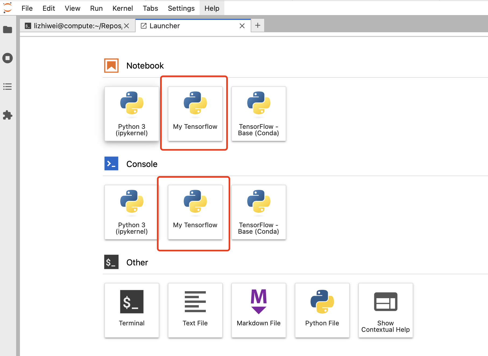

# Instructions of VM setup.

# Clone the Tensorflow Env
Open a Terminal window and execute:
```bash
/data/conda-clone-tensorflow.sh
```
Exit the terminal. Your conda environment will auto activate the next time you open Terminal.

After this step, you can see "My-Tensorflow" section on Luncher page:
 


# Get GitHub Credential
1. Create a GitHub classic access token with repo scope(s) from: https://github.com/settings/tokens
2. Open Terminal on the VM
3. Substitute `<github-username>` and `<github-token>` with the appropriate values accordingly, then execute:
   ```bash
   echo "https://<github-username>:<github-token>@github.com" > ~/.git-credential && chmod 600 ~/.git-credential
   ```
   
# Setup GitHub To Work Nicely With Jupityer Notebooks.

Execute the following commands in the terminal:
```
git config filter.strip-notebook-output.clean 'jupyter nbconvert --ClearOutputPreprocessor.enabled=True --ClearMetadataPreprocessor.enabled=True --to notebook --stdin --stdout --log-level=ERROR'
git config filter.strip-notebook-output.smudge 'cat'
git config filter.strip-notebook-output.required true
```


# Clone Catalog-ml and Catalog-exec repo
1. Create a directory in your homedir for GitHub Repos `mkdir Repos`
2. In the Repo dir, clone the catalog-ml repo which contains Catalog-ML method and ML model module, and catalog-exec repo
    
   Example:

   ```bash
   git clone https://github.com/informatics-isi-edu/eye-ai-ml.git
   git clone https://github.com/informatics-isi-edu/eye-ai-exec.git
    ```
3. Change the notebook and Catalog-ML tools accordingly.
4. Push the changes after test.

# Start a Notebook Workflow
See [ML Workflow Instruction](ml_workflow_instruction.md)
