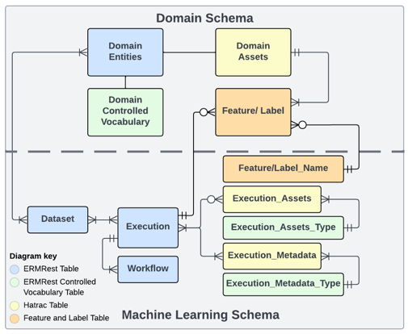

# DerivaML

DerivaML is a Python library for reproducible machine learning workflows
backed by a Deriva catalog. It captures code provenance, input data
versions, configuration, and outputs so experiments can be reproduced,
cited, and shared.

## What deriva-ml does

Four core concepts organize the library:

- **Catalog** — the schema + data store. An ERMrest-backed Deriva catalog
  with domain tables (Subject, Image, Observation, etc.) and an ML schema
  (Dataset, Execution, Workflow, Feature_Name).
- **Dataset** — a versioned, named collection of RIDs. Backs onto catalog
  snapshots so a named version always resolves the same rows.
- **Execution** — a tracked run of a Workflow. Captures inputs, outputs,
  environment, and status with full provenance.
- **Feature** — structured, provenance-linked annotations on existing rows.
  The unit of record for labels, predictions, and derived metadata.

## When to use deriva-ml

Strong fit:

- Research labs where data governance, audit trails, and multi-annotator
  ground truth are first-class requirements.
- Multi-site collaborations that need citable dataset identifiers and
  reproducible execution records.
- Biomedical imaging, clinical records, or similar domains with structured
  schemas and vocabulary-controlled annotations.

Weaker fit:

- Quick single-dataset experiments where a folder of files and git is
  enough. deriva-ml has a non-trivial setup cost; don't pay it without the
  governance need.
- Online feature-serving for low-latency inference. deriva-ml is
  research-oriented; Feast / Tecton are better for that.

See also: _Deriva-ML: A Continuous FAIRness Approach to Reproducible
Machine Learning Models_ (Li et al., 2024, IEEE e-Science).

## Starting a new project

To start a new deriva-ml project, use the
[deriva-ml-model-template repository](https://github.com/informatics-isi-edu/deriva-ml-model-template).
It provides:

- Hydra-zen configuration scaffolding
- CLI entry points (`deriva-ml-run`, `deriva-ml-run-notebook`)
- GitHub Actions for versioning and documentation deployment
- An example model (CIFAR-10) with config variants

These docs cover the deriva-ml library itself, for developers who already
have a project and want to understand the library's concepts and APIs.
Start with the [User Guide](user-guide/exploring.md) for a task-oriented
walkthrough, or jump to the [API Reference](api-reference/deriva_ml_base.md)
for per-method documentation.

## Further reading

The underlying FAIR-data principles are described in:

> Dempsey, William, Ian Foster, Scott Fraser, and Carl Kesselman.
> "Sharing begins at home: how continuous and ubiquitous FAIRness can
> enhance research productivity and data reuse."
> _Harvard Data Science Review_ 4, no. 3 (2022).
> [PDF](assets/sharing-at-home.pdf)

The deriva-ml architecture and design decisions are described in:

> Li, Zhiwei, Carl Kesselman, Mike D'Arcy, Michael Pazzani, and
> Benjamin Yizing Xu. "Deriva-ML: A Continuous FAIRness Approach to
> Reproducible Machine Learning Models." In _2024 IEEE 20th International
> Conference on e-Science (e-Science)_, pp. 1-10. IEEE, 2024.
> [PDF](assets/deriva-ml.pdf)
