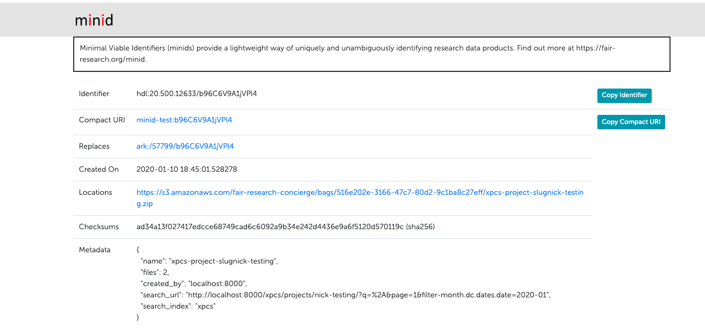

# Instructions of Executing a Notebook Workflow
## Overview

Deriva-ml is a package facilitate the end-to-end machine learning experiments with data and metadata stored in Deriva platform. 
The usage of
Deriva-ml needs: 
1. The data schema mentioned above for saving and versioning machine learning experiments data 
and metadata
2. A Catalog-ml tool, derived from Deriva-ml for data curation specific to a data catalog.

The following instructions are tailored to the Eye-AI catalog, with eye-ai-ml serving as the catalog-ml tool. 
For a practical demonstration, refer to this Colab 
[example](https://github.com/informatics-isi-edu/eye-ai-exec/blob/main/notebooks/Eye_ai_Image_Cropping_workflow.ipynb) 
illustrating the image cropping process within the Eye-AI catalog.

## Steps
### 1. Create a configuration file to describe the details of what the notebook will do.
This configuration JSON file specifies the datasets, model assets, workflow, and controlled vocabulary for an execution:
    
```JSON
{
    "bdbag_url" : ["minid:TzKL4p8tK60C"],
    "models": ["2-5PX8"],

    "workflow":{
        "name" : "Model training",
        "url": "https://github.com/owner/repo/blob/main/file_path",
        "workflow_type": "Model training",
        "version": "0.01",
        "description": "Model training template"
    },
    "execution":{
        "description" : "Training template"
    },
    "workflow_terms": [
        {"term": "Workflow_Type",
         "name": "Model training",
         "description": ""
        },
        {"term": "Execution_Metadata_Type",
         "name": "****",
         "description": ""
        },
        {"term": "Execution_Asset_Type",
         "name": "***",
         "description": ""
        },
        {"term": "Diagnosis_Tag",
         "name": "***",
         "description": ""
        }
    ]
}
```
- **bdbag_url**: is a list of datasets' minid. The minid of a dataset can be found on the dataset detailed page.
 Click `Export` -> `BDBag to Cloud` -> `Copy Compact URI`. Then past to the `bdbag_url` list in the configuration file.
 

- **models**: a list of RIDs from the Execution_Assets table if the assets need to be used in the current execution.  Models will be automatically downloaded when the execution workflow is initialized.
- **workflow**: contains several data fields for workflow table, see Workflow table description in last section. If 
using the same workflow created before, please ensure the url is the same.
- **execution**: Add a description of the current execution on the workflow.
- **workflow_terms**: is a list of controlled vocab needed for data generated by the workflow. Each element of the list
 is a dictionary, where `term` is the controlled vocabulary table name, `name` is the controlled vocab term name, 
 `description` is a description for the term. When creating a new controlled vocab term, please check the catalog 
 to make sure there's no appropriate term for use. When reusing an existing term, please use the exact term `name` shown
 in catalog. Currently, the following term types are allowed:
    * "Execution_Metadata_Type.  Used to identify the various types of files that may be used to configure an execution.
    * Execution_Asset_Type. Identifies the type of output file produced by the execution
    * Diagnosis_Tag. If the execution produces a lable for an image, this value allows 


### 2. Upload the configuration file to catalog 
Upload via web UI: go to Execution Metadata table -> `create` -> select configuration json file at `URL` -> select an 
Execution Metadata Type (i.e. Execution_Config) at `Execution Metadata Type` -> `Save` -> get the RID of the uploaded 
configuration file. This RID will be used in step 6.

### 3. Notebook - install dependencies

```python
!pip install --upgrade --force pydantic git+https://github.com/fair-research/bdbag git+https://github.com/informatics-isi-edu/deriva-py git+https://github.com/informatics-isi-edu/eye-ai-tools git+https://github.com/informatics-isi-edu/deriva-ml git+https://github.com/informatics-isi-edu/eye-ai-ml
import json
import os
from eye_ai import EyeAI
import pandas as pd
from pathlib import Path, PurePath
import logging
```
In the pip installation, the `eye-ai-ml` and `eye-ai-tools` GitHub repos are installed for the Eye-ai use case.

### 4. Notebook - login to Deriva via Globus auth

```python
DEBUG_MODE = True #@param ["False", "True"] {type:"raw"}
catalog_id = "eye-ai" #@param
DEFAULT_SERVER = 'dev.eye-ai.org' if DEBUG_MODE else 'www.eye-ai.org'

!deriva-globus-auth-utils login --no-browser --host {DEFAULT_SERVER}
```

### 5. Notebook - initiate tools

```python
EA = EyeAI(hostname = DEFAULT_SERVER, catalog_id = catalog_id, cache_dir= 'content/cache/', working_dir='content/working/')
logging.basicConfig(level=logging.INFO, format='%(asctime)s - %(levelname)s - %(message)s', force=True)
```
The `cache_dir` is the path to directory for data caching. The materialized BDbag will be saved there. 
The `working_dir` is the path to a directory that will save temporary files and Execution_Assets and Execution_Metadata folder.
The content under Execution_Assets and Execution_Metadata will be deleted after successfully upload to catalog by default.

### 6. Notebook - initiate an execution

```python
configuration_records = EA.execution_init(configuration_rid="2-5QFA")
configuration_records.model_dump()
```

Fill the configuration RID we get from step 2 to `configration_rid`. The `execution_init` method will do the following:
- Create folders `Execution_Assets` and `Execution_Metadata` under `working_dir`.
- Download the `models` from Execution_Assets table based on RIDs in the configuration files to Execution_Assets folder.
- Download the configuration file from Execution_Metadata table to Execution_Metadata folder.
- Materialize the dataset bags to `cache_dir` with a sub-folder name "bag-minid:{minid}". The data within the dataset will
be in `bag-minid:{minid}` -> `Dataset_{dataset RID}`.
- Create or extract the workflow in the catalog. Return the RID of the workflow for use.
- Create a new execution and return its RID.
- Create or extract the terms in the controlled vocab table needed for new data. Return the term name and RID pairs.

Sample return:
```
{
    'vocabs': {'Workflow_Type': 
                [{'name': 'Image Cropping', 'rid': '2-5NRG'}],
               'Annotation_Type': 
                [{'name': 'Optic Nerve', 'rid': '2-5PWP'}]},
    'execution_rid': '2-5QGT',
    'workflow_rid': '2-5QFT',
    'bag_paths': [PosixPath('/content/test/bag-minid:TzKL4p8tK60C/Dataset_2-5K2C')],
    'assets_paths': [PosixPath('test/Execution_Assets/optic_disk_crop_model.hdf5')],
    'configuration_path': PosixPath('test/Execution_Metadata/Execution_Config-test_cropping.json')
}
```
Access the value by `configuration_records.{instance_name}`. For example: `configuration_records.execution_rid` -> '2-5QGT'.\
After this step, a new execution record is created in the Execution table. Refresh the Execution table webpage to get the 
**realtime status** of the execution from the `Status` and `Status Detail` columns.

### 7. Notebook - data preprocessing
Some common data preprocessing steps can be encapsulated to a catalog-ml method.

### 8. Notebook - machine learning execution 
This section is managed by a context manager. Run the machine learning algorithm inside the context manager. The 
context manager will log the status of execution back to the data catalog.

```python
with EA.execution(execution_rid=configuration_records.execution_rid) as exec:
  # Run machine learning algorithms here ...
  # ...
```
Inside the machine learning scripts, if any outputs need to be saved back to the catalog, save them into the  
right directory.
- Metadata: Save to the directory: `{working_dir}/Execution_Metadata/{Execcution_Metadata_Type_Name}-{filename}.{ext}`
- Assets (model, output images, etc.): Save to directory  `{working_dir}/Execution_Assets/{Execution_Assets_Type_Name}/{filename}.{ext}`

The Execution_metadata_Type and Execution_Assets_Type_Name are controlled vocabularies. They can be created or retrieved 
by `workflow_terms` in configuration file in steps 1 and 6.

### 9. Notebook - save execution metadata and assets back to catalog
```python
uploaded_assets = EA.execution_upload(configuration_records.execution_rid)
```
This method will upload all the generated files in `{working_dir}/Execution_Assets/` and `{working_dir}/Execution_Metadata/` to 
the data catalog. After this step, all the files can be found on the execution detailed page or Execution_Assets and 
Execution_Metadata tables respectively.\
The return of the method is a dictionary contains file directory information in `data_dir` and metadata in data catalog 
for further metadata analysis.

### 10. Notebook - save other metadata and assets back to the catalog
If there are other metadata and associations that need to be saved back to the catalog, the catalog-ml method can be built and used
in this case.


# Instructions of Executing a Script Workflow
The steps are the same as notebook. Here is an 
[example](https://github.com/informatics-isi-edu/eye-ai-exec/blob/main/scripts/Image_cropping.py).


