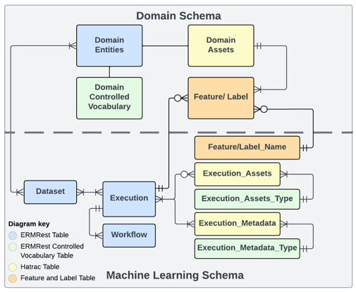

## Overview
Deriva-ML is a Python utility designed to streamline end-to-end machine learning (ML) experiments by integrating data 
and metadata stored on the Deriva platform. It facilitates a seamless workflow for managing data catalogs, preprocessing, 
model execution, and result documentation.

Key components of Deriva-ML include:
- Data Catalog: The catalog must include both the domain schema and a standard ML schema for effective data management.
  
- Catalog-ML Tool: A tool derived from Deriva-ML for configuring data curation tasks tailored to specific data catalogs.

#### Installation
To install Deriva-ML and its dependencies, use the following commands:
```python
!pip install git+https://github.com/informatics-isi-edu/deriva-py.git
!pip install git+https://github.com/informatics-isi-edu/deriva-ml 
!pip install git+https://github.com/informatics-isi-edu/eye-ai-ml
```
## A Notebook workflow
The Deriva-ML notebook workflow consists of an end-to-end process that includes:
- Data migration from the catalog to the runtime environment. 
- Data preprocessing. 
- Execution of ML experiments. 
- Storing outputs and metadata back into the catalog.

### Step 1: Setup the environment
#### Load prerequisite packages
```python
import json
import os
import sys
from pathlib import Path
from deriva_ml.dataset_bag import DatasetBag
import pandas as pd
from pathlib import Path, PurePath
import logging
from deriva_ml.deriva_ml_base import MLVocab as vc
from deriva_ml.execution_configuration import ExecutionConfiguration, Workflow, Execution
from <catalog_ml> import <catalogML>
logging.basicConfig(level=logging.INFO, format='%(asctime)s - %(levelname)s - %(message)s', force=True)
```
#### Login to the Deriva catalog
```python
from deriva.core.utils.globus_auth_utils import GlobusNativeLogin
host = 'www.***'
catalog_id = "***"

gnl = GlobusNativeLogin(host=host)
if gnl.is_logged_in([host]):
    print("You are already logged in.")
else:
    gnl.login([host], no_local_server=True, no_browser=True, refresh_tokens=True, update_bdbag_keychain=True)
    print("Login Successful")
```

#### Set working and caching directories
- **Cache Directory**: Used for saving materialized dataset bags. 
- **Working Directory**: Stores temporary files for the execution, such as metadata and features, which are uploaded to the catalog.
  (The content under this directory may be deleted after successfully upload to catalog by default.)
```python
cache_dir = Path.home() / 'data'
working_dir = Path.home() / 'data'
ml_instance = catalogML(hostname = host, catalog_id = catalog_id, cache_dir= cache_dir, working_dir=working_dir)
```

### Step2: Execution Configuration
Before starting execution:
- Define the workflow and related objects (datasets, models).
- Cache all required files in the caching directory.

- **Configuration Parameters**
- bdbags: List of dataset rids found in the catalog's Dataset table.
- models: List of execution asset rids from the Execution_Assets table.
- execution: A descriptive Execution object.
- workflow: A Workflow object, including its type and associated code scripts.
  - Instanciate the workflow by `Workflow()`
  - The workflow type is a controlled vocabulary term. Make sure the term is already existed in the catalog, 
  or create the new term before use. To create a new workflow_term, you can use 
  `ml_instance.add_term(vc.workflow_type, <term_name>, description="***")`. Detailed description of how to add a new control
  vocabulary term in the catalog see ##ToDo
- description: A textual summary of the current execution.

Initialize the execution by `ml_instance.initialize_execution(config)`.
A full record of directory of cached data and files, and rids of current execution will be returned.\
Example:
```python
# Add Workflow Vocab terms
ml_instance.add_term(vc.workflow_type, "Test Workflow", description="A test Workflow for new DM")
# Workflow instance
test_workflow = Workflow(
    name="Test Sample Workflow",
    url="https://github.com/***",
    workflow_type="Test Workflow"
)
# Configuration instance
config = ExecutionConfiguration(
    bdbags=[<dataset_rid_1>,<dataset_rid_2>],
    models = [<execution_asset_rid>],
    execution=Execution(description="Sample Test Execution"),
    workflow=test_workflow,
    description="Our Test Workflow instance")
# Initialize execution
configuration_record = ml_instance.initialize_execution(config)
print(configuration_record)
```

Sample return:
```
caching_dir: <cache_dir>
working_dir: <working_dir>/<username>/EyeAI_working
execution_rid: 5-SGCY
workflow_rid: 5-R6FW
bag_paths: [PosixPath('<cache_dir>/<datasetRID_checksm>/Dataset_<rid>')]
asset_paths: [PosixPath(<cache_dir>/<asset_type>/<file>)]
configuration: bdbags=['2-7K8W'] models=['2-4JR6'] 
                workflow=Workflow(name='Test Sample Workflow', url='https://github.com/***', workflow_type='Test Workflow', version=None, description=None) 
                execution=Execution(description='Sample Test Execution') description='Our Test Workflow instance'
```
### Step3: Access Datasets
In the notebook environment, you can save the downloaded dataset in to a `DatasetBag`.
It is built on top of an `sqLite` database, enabling easy access to the tables by table name and datasets curation.
- Build DatasetBag from downloaded data: `ds_bag = DatasetBag(configuration_record.bag_paths[i])`
- Find all the tables in the database by `ds_bag_i.list_tables()`
- Load the data in a table to pandas.DataFrame by `ds_bag.list_tables(table_name)`

### Step4: ML Execution
Run ML algorithms within a managed context. This ensures execution status is logged back to the catalog.
```python
with ml_instance.execution(configuration=configuration_record) as exec:
  # Run machine learning algorithms here ...
  pass
```

### Step5: Upload results
Save and upload outputs to the catalog, categorized into:
- Metadata: Stored in the directory obtained by execution_metadata_path.
- Assets: Stored in the directory obtained by execution_assets_path.

Ensure that the metadata and asset types exist in the catalog before uploading.
```python
# Add controlled vocabulary terms for metadata and assets
ml_instance.add_term(vc.Execution_Metadata_Type, "Example Metadata", description="Metadata description")
ml_instance.add_term(vc.Execution_Asset_Type, "Example Asset", description="Asset description")

# Upload files to the catalog
ml_instance.upload_execution(configuration=configuration_record, clean_folder=True)

```

Upon completion, all files can be accessed in the Execution Assets, Execution Metadata, and Features tables, 
or through the current execution in the Execution table.


