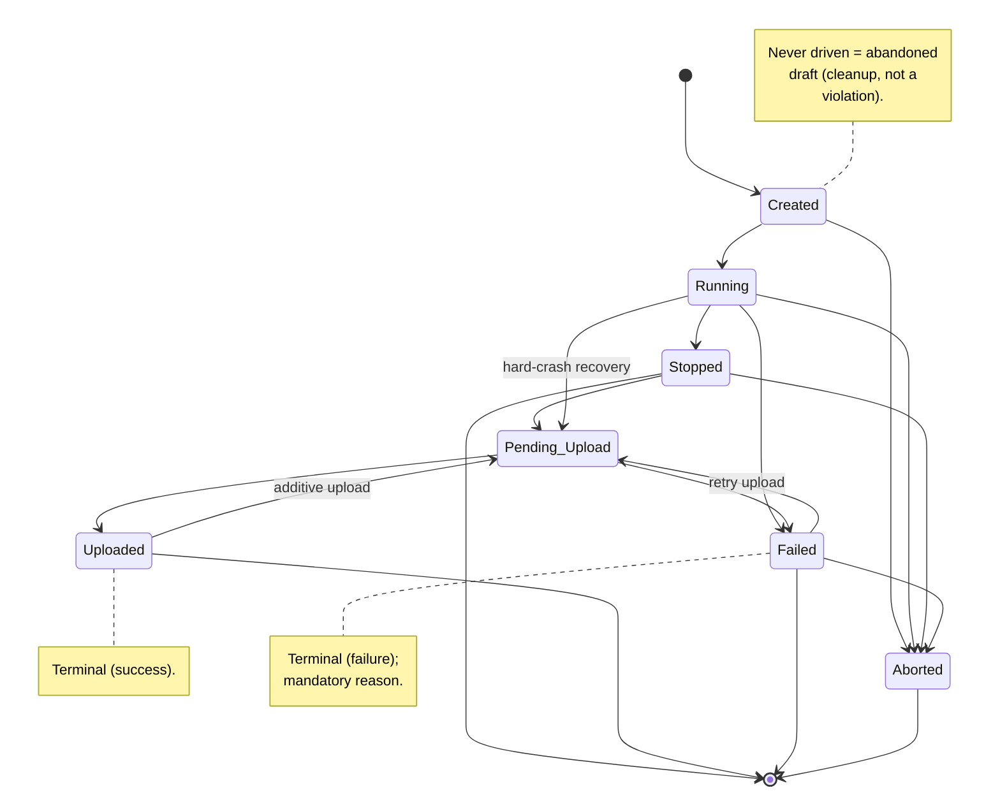
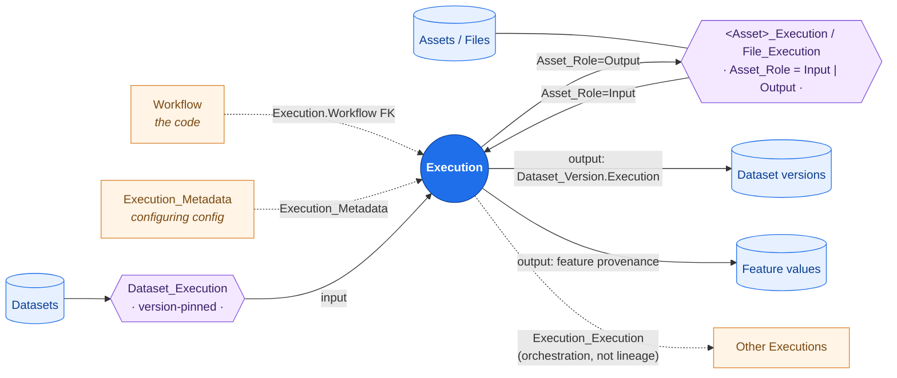

r# Execution Provenance Contract

This is the specification for execution provenance in DerivaML: the data
model that records how every artifact came to exist, and the completeness
contract that every execution must satisfy. It is the single normative
reference for what provenance *is* and what *must* be true of it; it
consolidates what was previously implicit across the catalog schema,
[ADR-0001](../adr/0001-lineage-walks-data-flow-not-orchestration.md), and
the Asset_Role note in `CLAUDE.md`.

The document has two parts: **the model** — the entities, edges, and roles
that constitute complete provenance — and **the contract + enforcement** —
what must hold for every execution, how it is guaranteed at write time, and
how violations are detected.

## In brief

If you are writing an execution, this is the whole contract in practice. The
framework records the rest.

- **Wrap the work in the context manager:** `with ml.create_execution(config)
  as exe:`. This drives the lifecycle and guarantees the run reaches an
  honest terminal state.
- **Declare your inputs in the config** — datasets in `datasets=`, assets in
  `assets=` (a RID, or `LocalFile("/path")` for a local file the framework
  registers; a bare string is always a RID, never a path). Declared inputs
  become provenance edges automatically; nothing you read off disk without
  declaring is recorded.
- **Run from committed code.** A workflow needs a real URL and a non-empty
  checksum, which you get by running a committed script — not by pasting into
  a REPL.
- **The framework writes the edges**: which workflow ran, what was consumed
  (input), what was produced (output: datasets, assets, features), and the
  configuration. You don't write these by hand.
- **Failures are kept, not hidden.** A failed run is recorded as `Failed`
  with a reason and whatever it established before failing.

Everything below is the precise statement of these rules, why they are drawn
where they are, and how they are enforced and audited.

## Goals

The contract serves five standing aims. Every rule below follows from them,
and future changes should be judged against them.

1. **Traceable from the catalog alone — for *every* artifact.** For any
   artifact (dataset version, feature value, asset, file), the catalog
   answers "what produced this, from what declared inputs, with what code
   (workflow URL + checksum) and configuration?" — without access to
   anyone's disk, shell history, or memory of a session. *Every* artifact
   traces to a producing execution; when an artifact has no real producer (it
   was inserted outside any run), it attributes to the **unknown-provenance
   execution** sentinel so the answer is an explicit "unknown origin," never
   a dead end (see *Artifacts with no producing execution*). The question
   always returns *something*.

   **Scope: this contract guarantees a complete provenance *graph*, not
   bit-for-bit reproduction.** It records *what* produced an artifact and
   *what* it depended on, traceably. It does **not** by itself guarantee you
   can re-run and get the identical result — that additionally needs
   environment capture (dependency lockfile, container/image digest, random
   seeds, hardware, pinned dataset *snapshots* rather than dev versions),
   which this contract treats as *recommended* `Execution_Metadata`, not
   mandated fields. See *Reproducibility: what the graph does and does not
   give you* for the precise boundary. Closing that gap (mandatory structured
   reproduction metadata) is named as a v2 follow-on, not v1.

2. **Record what a run logically depended on — not which API calls it
   made.** Provenance tracks a run's actual dependencies (the dataset it
   consumed, the external file it ingested), even when the code reached them
   indirectly. This is why "consumed" is defined by the *declared
   configuration*: an undeclared dependency is an authoring error, not an
   accepted gap.

3. **Every driven execution terminates honestly.** A run that started leaves
   a terminal state telling the truth about its outcome — success, failure
   (with a reason), or abandonment. Non-terminal-forever and "failed with no
   reason" are both forbidden. Failures are kept, not discarded.

4. **Enforce what DerivaML controls; verify or detect the rest; never fake
   it.** The trust boundary is explicit. DerivaML *guarantees* what it records
   locally: the checksum it captured, the edges it wrote from your
   declarations, the context-manager lifecycle. It can only *verify or
   detect* what lives outside its control: whether an external host still has
   the code, whether a human declared a dataset instead of a loose file,
   whether a human drove an interactive session to completion.

   Crucially, the contract never papers over a gap. It does not manufacture
   provenance, and it does not silently rewrite a record on a heuristic.
   Instead: a true gap is recorded as *explicitly unknown*; a record that is
   honest but cannot be re-verified later is *complete-but-unverifiable*; and
   any genuine ambiguity is left for a human to resolve.

5. **The honest path is the easy path.** Compliance comes from making the
   *blessed path* — the context manager plus declared inputs, the supported
   way to run a recorded execution — the path of least resistance, backed by
   loud warnings on the gross failure mode. It does not come from hard gates
   that punish legitimate work and push authors toward untracked interactive
   runs. ("Blessed path" is used throughout for this context-manager-driven
   way of running.)

## The execution state model

Provenance is anchored to an execution's lifecycle state, so the state
machine is part of this specification. There are **7 states** (canonical
source: `deriva_ml.execution.state_store.ExecutionStatus`; transitions:
`deriva_ml.execution.state_machine.ALLOWED_TRANSITIONS`). All transitions go
through the state machine; a direct write to `Execution.Status` is a bug.

### States

| State | Meaning | Terminal? |
|---|---|---|
| `Created` | Row exists; lifecycle not yet started. Set by `create_execution()`. | No |
| `Running` | `__enter__`/`execution_start()` ran; `start_time` set; work in progress. | No |
| `Stopped` | Algorithm finished cleanly; `duration` computed. Terminal unless it advances to `Pending_Upload` (see tiebreaker). | Conditional |
| `Pending_Upload` | Outputs staged; upload in progress / retryable. | No (transient) |
| `Uploaded` | Outputs uploaded; clean end for an artifact-producer. | Yes (success) |
| `Failed` | The run failed. Carries a **mandatory reason** (`Status_Detail`). | Yes (failure) |
| `Aborted` | Did not finish; closed without success. Set on explicit / `__del__` / operator abort. | Yes (abandoned) |

A **driven** execution left in a non-terminal `Running` or `Pending_Upload`
state violates the honest-termination obligation — it started and never
honestly finished. A row still in `Created` was never driven (the obligation
never attached); it is an abandoned draft for cleanup, not a violation (see
*Definitions*).

**`Stopped` is dual-purpose** — it is both a *terminal* state (a clean run
with nothing to upload) and a *transit* state on the happy path
(`Stopped → Pending_Upload`). The row alone does not distinguish them.

The tiebreaker must be evaluable from durable catalog state. Whether outputs
are still staged for upload is known only to the running process, not to a
catalog-side audit, so it cannot be the discriminator. The tiebreaker is
therefore framed on the catalog:

> A `Stopped` execution is treated as **terminal** unless it later
> transitions to `Pending_Upload`. While the producing process is live, that
> process owns the `Stopped → Pending_Upload → Uploaded` advance; a
> catalog-side audit cannot tell "Stopped, done" from "Stopped, about to
> upload" from the row alone, so it uses the execution's `last_activity`
> heartbeat — a `Stopped` row with no recent activity is treated as a
> terminal clean stop, not as stranded mid-upload.

The practical consequence: an artifact-producing run is expected to reach
`Uploaded` (its outputs imply staged assets), so a *long-idle* `Stopped`
artifact-producer is a likely "stopped before uploading" gap the audit
surfaces for review; a `Stopped` **probe** (no outputs) is a clean terminal
state. This is a heuristic, not a hard signal — which is why resolution is
human-invoked (see *Honest termination*), never an automatic re-transition.

### Allowed transitions



The happy path is `Created → Running → Stopped → Pending_Upload →
Uploaded`. Terminal states are `Uploaded` (success), `Stopped` (clean, no
outputs to upload), `Failed`, and `Aborted`. The non-obvious edges:

- **`Running → Pending_Upload` (hard-crash recovery)** — the process was
  killed mid-run, so `__exit__` never fired to move it to `Stopped`; the run
  is resumed straight into upload.
- **`Failed → Pending_Upload` (retry upload)** — an upload that failed is
  retried after the staged outputs are intact.
- **`Uploaded → Pending_Upload` (additive upload)** — a second output batch
  from a different lifecycle owner is uploaded against an already-completed
  execution.
- **`→ Aborted`** is legal from any pre-terminal state (`Created`,
  `Running`, `Stopped`, `Failed`) but **not** from `Uploaded` — a
  successfully completed run is not abandoned.

### What each lifecycle step writes

- **`create_execution()`** — creates the Execution row at `Created` with the
  Workflow FK and the configuring `Execution_Metadata`.
- **`__enter__` / `execution_start()`** — `Created → Running`, sets
  `start_time`. Materializes `datasets=` inputs and writes their
  `Dataset_Execution` input edges; resolves `assets=` input edges.
- **`__exit__` / `execution_stop()`** — `Running → Stopped` (clean, computes
  `duration`) or `Running → Failed` (exception, records the reason).
- **`commit_output_assets()`** — `Stopped → Pending_Upload → Uploaded`;
  writes output assets (`Asset_Role="Output"`), authored dataset versions
  (`Dataset_Version.Execution`), and feature values. Performs the
  no-input commit check (see Enforcement).

`Execution_Duration`, `Download_Duration`, `Upload_Duration`, `Status`, and
`Status_Detail` are catalog columns. `start_time` / `stop_time` are
SQLite-only — they read as null over the catalog read APIs for every
execution; the `duration` columns are the catalog-visible timing record.

**A deliberate Goal-1 carve-out:** absolute wall-clock timestamps are
therefore *not* reconstructable from the catalog alone — only elapsed
`duration` is. This is an accepted exception. Absolute start/stop time is an
operational detail of where the run executed, not part of its data
provenance (what it consumed and produced); the reproducibility question
Goal 1 protects is answered by workflow + inputs + outputs + duration, none
of which depends on a wall-clock timestamp. Catalog row-creation time
(`RCT`) remains available as a coarse "when" if needed.

## Scope

The terms below build on the state model above; states named here
(`Created`, `Running`, `Stopped`, `Uploaded`, `Failed`, `Aborted`) are
defined in that section.

### Definitions

- **Driven execution** — an execution that left `Created` for `Running`;
  i.e. its lifecycle was actually started (`__enter__` / `execution_start()`
  ran). An execution that was created but never started (still `Created`) is
  *not* driven, so the per-execution obligations below — which apply to
  driven executions — do not attach to it. A never-driven `Created` row is
  not a *violation* of those obligations (there was no run to terminate); it
  is an **abandoned draft**. The audit reports long-idle `Created` rows so an
  operator can garbage-collect them (`ml.gc_executions(...)`), but they are a
  cleanup item, not a contract breach. (Contrast: an execution that *was*
  driven and then stranded in `Running`/`Pending_Upload` **is** an
  honest-termination violation — it started and never honestly finished.)
- **Terminal state** — a lifecycle end state: `Uploaded`, `Stopped` (clean,
  with nothing to upload), `Failed`, or `Aborted`. The non-terminal states
  are `Created`, `Running`, and `Pending_Upload`.
- **Artifact-producing execution** — a driven execution that produces a
  durable output: a dataset version, a feature value, or an uploaded asset.
  This is an **outcome property, determined at commit** — an execution is
  treated as a probe until it writes its first durable artifact, at which
  point it becomes artifact-producing and the artifact-producer rules (below)
  are checked. The classification is therefore not known at
  `create_execution()` time; see *Timing of the artifact-producer rules*.
- **Probe** (read/exploratory execution) — a driven execution that produces
  no durable artifact. Determined at commit (an execution that produced
  nothing).
- **Complete provenance** (the checkable predicate). A **successful**
  artifact-producing execution (terminal `Uploaded`, or `Stopped` with
  nothing to upload) has complete provenance iff **all** of:
  1. its **Workflow** has a well-formed URL **and** a non-empty checksum;
  2. it has **at least one declared input** — a `datasets=` dataset, an
     `assets=` asset, or a registered input `File` — **or** the
     unknown-provenance sentinel input (see Enforcement);
  3. **every produced artifact is role-tagged** as output
     (`Dataset_Version.Execution` authorship, or `Asset_Role="Output"`).

  `Failed` and `Aborted` are **honestly-terminated but not
  complete-provenance** producers: a failed or abandoned run records what it
  established up to the failure/abort (and, for `Failed`, a mandatory
  reason), but its outputs are *partial and not to be trusted as finished* —
  so it is not asserting the complete record a successful run does. The
  obligations on them are honest termination + (for `Failed`) the reason, not
  the full predicate. This predicate is what the audit (below) tests for
  successful producers; each clause maps to one audit query.

### What the contract requires

The contract applies to **every driven execution**. A driven execution MUST
reach a **terminal state** that honestly records its outcome; it may not be
abandoned mid-lifecycle.

- **Success** → `Uploaded` (or `Stopped` if it produced nothing to upload),
  with **complete provenance** for what it consumed and produced.
- **Failure** → `Failed`, with the failure recorded (see below).
- A **probe** must still terminate honestly, but is exempt from the
  *output-artifact* clauses.

Two obligations are deliberately distinguished:

- **Honest termination** — reach a terminal state. Applies to every driven
  execution.
- **Complete provenance** — record all consumed/produced edges with roles.
  Applies to every artifact-producing execution.

### Failed executions are first-class

Failure is a provenance outcome to **keep**, not discard. A failed execution
records **everything established up to the point of failure**:

- `Failed` status.
- **The failure reason is mandatory** — persisted durably on the Execution
  row (`Status_Detail` / error). A `Failed` row with no reason is itself a
  violation.
- The Workflow FK and configuring metadata (`Execution_Metadata`).
- **All inputs consumed before the failure** (`Dataset_Execution` rows and
  input assets), each with its role.
- **Any outputs durably written before the failure** (partial feature
  values, a partial dataset version, uploaded assets), each with its role —
  recorded under the `Failed` execution so a consumer knows not to trust
  them as finished.

Failure can strike before any work, mid-run, or during upload; the rule is
uniform — the recorded provenance is *as complete as the run actually got*.

## The provenance model

**Provenance is recorded by executions and the relationships between an
execution and the other entities it touches.** The Execution is the hub:
every artifact in the catalog points back to the execution that produced it,
and every execution points at what it depended on. Provenance is exactly the
set of these relationships. An execution relates to:

- **a Workflow** — the code that ran (exactly one; the *how*).
- **configuring metadata** — the configuration that parameterized the run
  (the *with what settings*), captured as `Execution_Metadata`.
- **datasets** — consumed (input) and/or produced (output).
- **assets** — consumed (input) and/or produced (output). *Files are a kind
  of asset* — the `File` table is an asset table whose `URL` *may* be an
  external reference rather than object-store-hosted bytes. A `File` is the
  reference-capable rung of the asset relationship, not a separate one (it
  may also hold hosted bytes; what distinguishes it is that it *can* be a
  pure reference).
- **features** — typed per-row values produced as output (e.g. labels,
  scores), written with the execution's provenance.
- **other executions** — orchestration / nesting links
  (`Execution_Execution`). These are recorded but are **not** part of
  data-flow lineage; see
  [ADR-0001](../adr/0001-lineage-walks-data-flow-not-orchestration.md).

The rest of this section makes each relationship precise.

Each relationship is recorded as a foreign key or, where it carries its own
attributes (notably the input/output role), as a row in an **association
table** that links the two entities. The asset relationship is the clearest
example: an asset is tied to an execution by an `<Asset>_Execution` /
`File_Execution` row whose **`Asset_Role` column** (`Input` / `Output`)
records the direction. The role is a property of *that association row*, not
of the asset or the execution.



*The Execution is the hub. Relationships that carry their own attributes are
reified as **association rows** (hexagons): `Dataset_Execution` pins the
consumed dataset version, and `<Asset>_Execution` / `File_Execution` carries
the **`Asset_Role`** column that records whether the asset was an `Input` to
or an `Output` of the execution — the role lives on the association row, not
on the asset or the execution. Dataset-version output is the authorship FK
`Dataset_Version.Execution`. Dotted edges describe the run (code, config) or
orchestration. Data-flow lineage (ADR-0001) walks the input/output edges
backward; it does not follow the `Execution_Execution` link.*

For every **driven** execution the catalog records:

1. **Workflow** — exactly one Workflow (FK `Execution.Workflow`, mandatory).
   For an artifact-producer the workflow must additionally carry a
   well-formed URL and a non-empty checksum (see *Workflow reproducibility*).
2. **Configuring metadata** — the configuration that parameterized the run,
   captured as `Execution_Metadata` assets (e.g. the resolved
   hydra/experiment config).
3. **Consumed inputs** (role = input):
   - **Datasets** — exactly those declared in `datasets=`, as version-pinned
     `Dataset_Execution` rows.
   - **Assets** — input assets via `<Asset>_Execution` with
     `Asset_Role="Input"` and an `Input_File` Asset_Type tag.
4. **Produced outputs** (role = output):
   - **Dataset versions** — via `Dataset_Version.Execution` authorship.
   - **Assets** — via `<Asset>_Execution` with `Asset_Role="Output"` and an
     `Output_File` Asset_Type tag.
   - **Feature values** — written with this execution's provenance.
5. **Role is unambiguous, and is always derived from context — never
   specified by the caller.** Where the role is *recorded* differs by
   artifact kind, but in every case it follows from *what the execution did*,
   not from a user-supplied flag:
   - **Datasets** — role is **structural**: an input is a row in
     `Dataset_Execution`; an output is `Dataset_Version.Execution`
     authorship. Different tables, so role cannot be misstated and there is
     nothing to specify.
   - **Assets / files** — role is the **`Asset_Role` column** on the
     `<Asset>_Execution` / `File_Execution` association row, set by the
     **operation**: materializing a declared input (download at execution
     start, or a `LocalFile`/asset declared in `assets=`) writes
     `Asset_Role="Input"`; producing a file (the commit / output-staging
     path, including `add_files` in the execution body) writes
     `Asset_Role="Output"`. The framework assigns the role from the call
     context; the user never passes it.

   A single artifact is never silently both. **The contract requirement: an
   asset's role is determined by context (consume ⇒ Input, produce ⇒
   Output), exactly as for datasets. APIs must not ask the caller to name a
   role.**

Per [ADR-0001](../adr/0001-lineage-walks-data-flow-not-orchestration.md),
data-flow lineage is *derived* by walking these edges
(`Dataset_Version.Execution` and `<Asset>_Execution` Output edges backward
to producing executions); it does not walk `Execution_Execution`
orchestration links.

### Every artifact has a producing execution

The execution is the **unit of provenance**: the contract's obligations hang
off executions, and the model above records what each execution produced. The
converse is what makes Goal 1 hold for *every* artifact, not just those that
happen to be execution-authored:

> **Every durable artifact (dataset version, feature value, asset, file)
> MUST attribute to a producing execution** — via the same output edges
> above (`Dataset_Version.Execution`, `<Asset>_Execution` with
> `Asset_Role="Output"`). An artifact with a null producer is a contract
> violation.

Most data is produced by a real, driven execution and this is automatic.
But data also enters a catalog **outside any run** — `add_files` called
standalone, direct API / Chaise inserts, bulk loads. Such an artifact has no
real producer, yet Goal 1 still requires "how did this come to exist?" to
return *something*.

#### Artifacts with no producing execution → the unknown-provenance execution

For this the contract seeds a **second sentinel: a canonical
*unknown-provenance Execution*** (the producer-side counterpart to the
unknown-provenance `File` of the no-input case). An artifact created with no
real producer attributes to it through the ordinary output edge
(`Dataset_Version.Execution = <unknown-exec>`, or an `Asset_Role="Output"`
link to it). The lineage walk then terminates at this sentinel and reports
**"unknown origin"** — an explicit, queryable answer rather than a null
dead-end. The two sentinels are duals:

| Gap | Sentinel | Edge |
|---|---|---|
| Execution declared no input | unknown-provenance **`File`** | input (`Asset_Role="Input"`) |
| Artifact has no producing execution | unknown-provenance **Execution** | output (authorship / `Asset_Role="Output"`) |

This rule applies to **every** artifact, new and existing — not just
artifacts created after the contract is adopted. New artifacts carry a
producer (real or sentinel) by construction. Existing artifacts with null
producers (on an established catalog, the large majority of dataset
versions) are brought into conformance by a one-time **backfill** that
attributes them to the unknown-provenance execution sentinel (see *Adoption
and backfill*); the backfill is part of adopting the contract, not a separate
optional cleanup. The audit reports any remaining null-producer artifact as a
violation.

**Exemption.** Platform/bootstrap rows seeded by catalog initialization
itself — controlled-vocabulary terms (`Asset_Role`, `Dataset_Type`, …),
schema-seed rows, the two sentinels — are *not* artifacts in this sense and
carry no producer obligation. They are the catalog's substrate, not data
produced within it.

### Idempotency, concurrency, and re-runs

- **Executions are not idempotent; each run is a distinct execution.**
  Running the same committed script twice produces **two** Execution rows,
  each with its own inputs, outputs, and timing. This is intentional: the
  two runs are distinct events in time and each is its own provenance record
  (they may consume different dataset versions, or one may fail). Provenance
  records *what happened*, and two runs happened.
- **Workflows *are* deduplicated, by checksum.** Identical source (same
  URL + checksum) resolves to the same Workflow row, so the two executions
  above share one Workflow — correctly, since it is the same code. Dedup is
  on the immutable code identity, not on the run.
- **Outputs are not auto-deduplicated against prior runs.** A re-run that
  authors a new dataset version creates a new version; one that writes
  feature values writes new rows under the new execution. Detecting that a
  re-run "produced the same thing" is out of scope — the contract records
  each production under its own execution and leaves equivalence judgments to
  the consumer.
- **Association edges are unique per (entity, execution).** The
  `<entity>_Execution` association tables carry a `(entity, Execution)`
  unique key, so the same input/output cannot be double-recorded against one
  execution; a retried edge-write reconciles to the existing row rather than
  duplicating it.
- **Single-writer per execution is assumed.** One execution is driven by one
  lifecycle owner (the context manager in one process). The lone exception
  is the **additive-upload** edge (`Uploaded → Pending_Upload → Uploaded`),
  where a second owner uploads a follow-on asset batch against an
  already-completed execution; the `(entity, Execution)` unique key keeps
  that safe. Concurrent drivers racing the *same* execution's lifecycle
  transitions are not a supported pattern and the contract makes no
  guarantees about the result.

### "Consumed a dataset" is defined by the configuration

**An execution consumed a dataset if and only if that dataset appears in the
`datasets=` parameter of its `ExecutionConfiguration`.** Consumption is
defined by the declared configuration — not by what the code happened to
read off disk, and never by post-hoc RID-set inference.

The model is authorship-canonical: input and output live in *different*
tables, so a dataset's role is never ambiguous.

- **Input edge** = a `Dataset_Execution` row (`Dataset`, `Dataset_Version`,
  `Execution`), written for each dataset in `datasets=`, version-pinned to a
  `Dataset_Version` RID.
- **Output edge** = `Dataset_Version.Execution` authorship.

This yields a hard, airtight runtime invariant:

> On a **successful** run: every dataset in `ExecutionConfiguration.datasets`
> ⟹ exactly one version-pinned `Dataset_Execution` input edge. No dataset in
> `datasets=` ⟹ no input edge. An author cannot declare a dataset input and
> have the edge dropped, nor obtain an input edge without declaring it.

**Partial input on failure.** Input edges are written as the declared
datasets are materialized (during `Created → Running`). If materialization
fails partway — e.g. dataset 3 of 5 will not resolve — the execution
transitions to `Failed` with a reason naming the unresolved dataset, and
records `Dataset_Execution` edges **for the datasets that successfully
materialized before the failure**. On the failure path the recorded edges
therefore reflect *inputs successfully consumed*, not the raw `datasets=`
list. This is deliberate: a partial record is more diagnostically useful
than none (you can see how far the run got), and it is the failure-section
rule ("everything established up to the point of failure") applied to
inputs. The total `datasets= ⟺ edges` equivalence holds for successful runs;
for failed runs the edges are a prefix of the declared set.

The author's obligation — *not* machine-enforceable — is to express a
dataset-shaped input *as* a dataset (in `datasets=`) rather than as, say, a
CSV dump of its RIDs. DerivaML cannot tell that an opaque file "is really
dataset X," so this is upheld by convention, review, and making the
`datasets=` path the path of least resistance.

### Workflow reproducibility: enforceable vs. verifiable

Reproducibility of the *code* is a goal that **cannot be guaranteed**,
because the code lives in an external system (e.g. GitHub) outside DerivaML's
trust boundary — repos are deleted, made private, force-pushed, commits
garbage-collected. The requirement splits along that boundary:

- **Enforceable (DerivaML's responsibility, a hard invariant):** an
  artifact-producing execution's workflow MUST carry a **well-formed URL**
  and a **non-empty checksum** captured from the code that actually ran.
  Recording these is fully within DerivaML's control; a degenerate URL (e.g.
  a `<stdin>` placeholder) or empty checksum on an artifact-producer is a
  **hard violation** — the *recording* failed.
- **Verifiable but not enforceable (a best-effort health signal):** whether
  the URL *still resolves* and the fetched bytes *still match the checksum*.
  The external host may have dropped the commit. A resolution failure is a
  flagged health concern, never a contract violation and never retroactive —
  an honestly-recorded workflow stays compliant even if the host later loses
  the bytes.

Probe/exploratory executions (Scope-exempt) MAY carry a degenerate workflow.

**How a violation is handled — one consistent rule.** "Hard violation" names
*what is wrong*, not *how the framework reacts*. The reaction is uniform
across the contract and matches the no-input check: at the point an
artifact-producer commits, a violated invariant (degenerate workflow, no
declared input, untagged output) produces a **loud, structured warning and a
durable mark** — it does **not** fail the commit or roll back the work. The
work already happened; refusing to record it would lose provenance, not
improve it (Goal 4: never fake, never destroy). The durable mark is what
makes the violation *findable* by the audit afterward. The schema does not
hard-enforce these as NOT-NULL constraints (the columns are nullable today),
by design — enforcement is the warn-and-mark-and-audit stack, not a database
constraint that would block legitimate edge cases. An operator who wants a
hard gate (e.g. "reject a release if any artifact-producer has a degenerate
workflow") layers that on top of the audit; the contract does not mandate it.

#### Timing of the artifact-producer rules

Because "artifact-producing" is an **outcome property determined at commit**
(see Definitions), the rules gated on it — the workflow URL+checksum
requirement and the complete-provenance predicate — cannot be checked at
`create_execution()` or `__enter__`: at those points the run may still turn
out to be a probe, and the workflow row (deduplicated by URL/checksum) was
created before the run's intent was known. **All artifact-producer rules are
therefore checked at the point the execution writes its first durable
artifact.** An execution is held to probe-level obligations until that
moment, then to artifact-producer obligations from it.

There is **more than one such write path**, and the check must fire at each —
not only at `commit_output_assets()`. A durable artifact is created by any of:
`commit_output_assets()` (uploaded assets), dataset-version authorship
(`Dataset_Version.Execution`), and feature-value writes (each feature row
carries its own `Execution` FK and is written outside the asset-commit path).
Whichever fires first is the moment the execution becomes an
artifact-producer, and the artifact-producer checks must be applied
consistently at all three. A single check wired only into
`commit_output_assets()` would miss a run that authors a dataset version or
writes features but uploads no assets.

A consequence to accept explicitly: a run can do real work under a
degenerate workflow and only discover at commit that the workflow is a hard
violation. That is the correct time to surface it — the alternative
(demanding artifact-producer intent up front) would force a declaration that
is frequently wrong (a "declared" producer that produces nothing, or a
"probe" that ends up writing an artifact) and would gate exploratory work
that should stay friction-free (Goal 5). The cost is that the diagnostic
arrives at commit rather than at start; the benefit is that the
classification is always *correct* because it reflects what actually
happened.

### External-resource ingest

An execution whose input originates **outside the catalog** — an external
labels file, a chart-review CSV — is consuming an **asset**, not a dataset.
This is the key framing: such a file is content (a file with bytes and a
hash), so it belongs in the `File` table as an input asset; it is **not** a
dataset (a curated collection of catalog rows). The correct provenance shape
for "build a dataset from an external file" is therefore:

> `File` (input asset) → Execution → `Dataset` (output)

— a complete, ordinary input→output record. A common point of confusion:
when the external file is a *list of RIDs* that happen to match some
dataset's members, it is tempting to think the run "consumed that dataset."
It did not. It consumed a **file**; the RID overlap is a coincidence of
contents, not a provenance edge. The dataset is the run's **output**, and
its input is the file. Modeling the file as an input asset makes the
provenance honest and complete with no special case.

Files are assets, so an external file behaves **like any input asset** — in
the config, to application code, and in the provenance graph. It is declared
as an input either by **`File` RID** (already registered) or by an
**explicit local-file spec** (`LocalFile(...)`, which the framework
registers). In the config it sits in `assets=` next to any other input
asset:

```python
ExecutionConfiguration(
    assets=[
        AssetSpec("<asset-rid>"),         # a catalog asset, by RID
        "<file-rid>",                     # an already-registered File, by RID
        LocalFile("/data/labels.csv"),    # a local file — framework registers it
    ],
    datasets=[DatasetSpec("<dataset-rid>@<version>")],
    ...,
)
```

(RID strings are shown as `<…>` placeholders; real RIDs come from a catalog
lookup, never a hard-coded literal.)

**A bare string in `assets=` is *always* a RID — never a path.** A local
file must be wrapped in an explicit `LocalFile(...)` spec; the framework does
**not** type-sniff a bare string to decide "RID or path." This is a
deliberate safety boundary, not just style:

- **No silent reinterpretation.** A mistyped RID fails as a bad RID; it can
  never be silently re-read as a filesystem path (or vice versa). The
  declaration means exactly one thing.
- **Filesystem reads are explicitly marked.** Because a path becomes an
  input only when the author wrote `LocalFile(...)`, a config populated from
  a less-trusted source (a shared-runner Hydra override, a sweep parameter,
  another user's config) cannot turn an arbitrary string into "read and
  catalog this file." A reviewer can see every local-file read as a typed
  declaration. (A runner that wants defense-in-depth MAY additionally
  restrict `LocalFile` reads to a configured root directory — a deployment
  policy the contract notes but does not mandate.)

This mirrors the dataset rule (Goal 2: declare, don't infer): intent is
declared by *type*, never recovered by inspecting a string's shape.

For a `LocalFile`, deriva-ml does the rest — computes the checksum (reusing
`FileSpec.create_filespecs`), mints the `File` row, and writes the
`<File>_Execution` edge with **`Asset_Role="Input"` derived from context**:
because the file is declared in `assets=`, it is a consumed input, so the
Input edge is written by the same input-edge mechanism the asset *download*
path already uses. The caller never names the role. Inside the run, the file
is read through the **same `asset_paths` surface** as any input asset. The
*implementation model* (the thin config spec, the on-the-fly registration
hook, the input-edge write, the download-skip for references) is in
*Implementation notes*; no user-side checksum work and no role flag is
imposed (Goal 5; role-from-context).

**Rule:** an external file consumed by an execution MUST be declared as an
input — a `File`-table row (mandatory `MD5`) linked via `<File>_Execution`
with `Asset_Role="Input"`. The role is assigned by context (the file is in
`assets=`), not specified by the caller. Only an **un-declared loose file** —
read off disk with no `File` row at all — violates the rule.

#### What minting a `File` RID records

Registering an external file **mints a catalog identity (a RID) for a file
the catalog does not host.** The `File` row carries three things, on the two
sides of the trust boundary (Goal 4):

- **RID + MD5 — durable, inside the boundary.** DerivaML mints the RID and
  **computes the MD5 from the file's bytes at registration** (the existing
  `FileSpec.create_filespecs` already does this). The MD5 is the content
  anchor: it records exactly *what* was consumed. The MD5 is *computed*,
  never caller-supplied — a caller-provided hash would defeat the one
  guarantee the row makes. (**Exemption:** the unknown-provenance `File`
  sentinel — see *The two unknown-provenance sentinels* — is bootstrap
  substrate, not a registered file. It carries a fixed marker MD5 and
  represents *no bytes*; the computed-from-bytes rule does not apply to it,
  precisely because it asserts "unknown content," not specific content.)
- **URL — a non-dereferenceable identity annotation, outside the boundary.**
  The `URL` column is **always populated** (never null). For a local file it
  is **not** a `file://` path but a **`tag:` URI** — the existing `FileSpec`
  convention (`core/filespec.py`), which normalizes a local path to
  `tag://<hostname>,<date>:file://<path>`. A `tag:` URI (RFC 4151) is *by
  design a unique name, not a retrieval address*: the scheme itself encodes
  "this identifies the file's origin; it is not a URL you fetch." So the
  "provenance annotation, not a retrieval path" property is carried by the
  URI scheme, not just by convention. The MD5 remains the only content
  guarantee; a `File` row minted this way is *complete-but-unverifiable*
  provenance by construction.

**Identity is URL-keyed (existing schema; no change).** The `File` table's
unique key is on `URL`, with `MD5` mandatory. Because the tag URI embeds
`(hostname, date, path)`, identity is scoped to that tuple:

- **Same tag URL, changed content → conflict.** Re-registering the same
  `(host, date, path)` after the bytes change collides on the URL key (it
  already binds that tag to a different MD5). Desirable: one recorded origin
  cannot silently hold two contents; reconcile explicitly.
- **Same content, different origin → different RIDs.** The same bytes
  registered from a different host — or the same host on a different day, or
  a different path — produce a different tag URI and therefore a distinct
  `File` row. Identity tracks the recorded *origin* `(host, date, path)`,
  not the content hash; this is accepted, not a defect.
- **Re-registering the identical (tag URL, content) pair reuses the row** —
  no duplicate RID.

**Hosting the bytes is optional; the checksum is not.** A `File` row may
hold a real URL + hosted bytes, or be a pure reference (URL + `MD5`, bytes
not hosted). The reference form is **complete-but-unverifiable** provenance
and is **compliant** — parallel to a checksummed workflow whose external
commit was later deleted. The `MD5` makes it complete (you know exactly
*what* was consumed); whether the URL still resolves is a best-effort health
signal, not a compliance condition. The reference form exists deliberately
so PII / large / licensed external data (e.g. an MRN-bearing CSV) can be
recorded by reference + hash without hosting the bytes.

## Enforcement & verification

The contract enforces what DerivaML controls and detects the rest; it does
not rely on a single hard gate. The pieces:

### Write-time edge guarantees

Declaring an input (`datasets=` / `assets=` / `add_files(...)`) makes the
checksummed record and the role-tagged edge **automatic and correct** —
airtight *given the API is used*. This is the mechanism behind both the
dataset-input invariant and the external-ingest rule.

### The no-input commit check

An artifact-producing execution that commits with **no recorded inputs of
any kind** receives a loud, structured warning — **not** a refused commit. A
hard block would mis-fire on legitimate input-less runs (a schema extension,
a scalar-parameter-only run) and would push authors away from the framework
and back toward the untracked interactive runs this contract exists to
prevent.

The warning also leaves a durable **unknown-provenance mark**, recorded as a
real input edge (not a side-channel flag): the gap is recorded as
*explicitly unknown*, not absent, so it is findable later. Silence and
"explicitly unknown" are different; the contract requires the latter.

**What this check does NOT catch (a deliberate limitation).** The check
fires on **zero** declared inputs — it catches the *symptom* (nothing
declared) but cannot *recover* an undeclared dependency. Note this is **not**
a "dataset consumed as a file" problem: under the asset framing above there
is no such thing — an external file is an input *asset*, the dataset is the
*output*, and the only failure mode is *failing to register the input file at
all*. That failure presents as zero inputs and is caught (warn + sentinel),
recorded as "unknown input." The residual, unavoidable limit is narrow: the
check cannot distinguish a *legitimately* input-less run (a schema extension)
from one that *forgot* to register its file — both warn, and a human
reading the description distinguishes them. What no machine can do is
reconstruct *which* file a forgetful run should have named. Declaring the
file as a `LocalFile` in `assets=` (Input by context) is a one-liner, which
keeps the "forgot" case rare by making declaration trivial.

### The two unknown-provenance sentinels

Both kinds of provenance gap are recorded **as real edges to seeded sentinel
rows**, keeping provenance in the graph rather than in side-channel flags.
Two sentinels, seeded at catalog initialization (alongside the
platform-default `Asset_Role` terms), are duals:

- **Unknown-provenance `File`** — for an artifact-producing execution that
  commits with **no declared input**. The framework links this `File` as an
  **`Input`** via `File_Execution` (`Asset_Role="Input"`) — the same edge any
  external-file input writes, pointed at the reserved row. Because the `File`
  table mandates `MD5` NOT NULL and a unique `URL`, it is a well-formed row
  with a reserved URL (e.g. `tag:deriva-ml,unknown-source`) and a fixed
  marker MD5.
- **Unknown-provenance Execution** — for an **artifact with no producing
  execution** (data inserted outside any run). The artifact attributes to
  this sentinel execution through the ordinary output edge
  (`Dataset_Version.Execution = <unknown-exec>`, or an `Asset_Role="Output"`
  link). A lineage walk from such an artifact terminates here and reports
  "unknown origin" instead of dead-ending on a null producer.

Each is a **single shared sentinel**, not a per-row instance. The edge
records *that* the origin is unknown, uniformly and auditably; richer detail
belongs in the row's description. Both make the gap visible in a lineage walk
and reduce the audit to a plain edge query rather than status parsing.

### Honest termination

DerivaML cannot force a human in an interactive session to drive a
lifecycle. Honest termination is therefore guaranteed for the blessed path
and *detected* (not auto-repaired) elsewhere:

1. **The blessed path guarantees termination.** `with
   ml.create_execution(...) as exe:` drives `Created → Running` on
   `__enter__` and `Running → {Stopped|Failed}` on `__exit__` (both clean
   and exception paths). `__exit__` always fires, so the context manager
   guarantees a terminal state. The contract names the context manager as
   the required path for any run of record; docs and template scripts push
   it. The `__del__` best-effort abort (fires only for non-terminal states
   with a live in-process catalog session) is an in-process backstop.
2. **Detection is read-only.** The audit reports executions stranded in
   non-terminal states as a health signal. It does not change state.
3. **Resolution is human-invoked.** A stranded row is resolved by an
   operator deliberately calling `ml.gc_executions(...)` or an explicit
   abort — never by a timer.

An **autonomous sweep is rejected by design.** A background process flipping
non-terminal → `Aborted` on a threshold (a) mutates production provenance on
a heuristic that is sometimes wrong, (b) treats the symptom rather than the
cause, and decisively (c) cannot distinguish "abandoned and did nothing"
from "did the work but never closed the lifecycle" — auto-stamping the
latter `Aborted` records a *different* falsehood. That judgment requires a
human. The contract's job is to stop *creating* stranded rows (the blessed
path does this); existing stranded rows are resolved by the one-time
adoption backfill (see *Adoption and backfill*), which aborts them
deliberately rather than on a timer.

### Audit

A read-only, catalog-wide scan surfaces all violations in one place. It
tests the **complete-provenance predicate** clause by clause (each clause →
one query):

- artifact-producers not in a terminal state (stranded non-terminal);
- artifact-producers with a degenerate URL or empty checksum on their
  workflow;
- artifact-producers with **zero** declared inputs (no input edge at all, not
  even the sentinel) — a violation;
- artifact-producers with an output that is not role-tagged;
- **artifacts with a null producer** (no producing execution and not
  attributed to the unknown-provenance execution sentinel) — a violation;
- `Failed` rows missing a reason.

The audit also **reports** (separately from violations) the **known-degraded**
cases — these are *compliant*, but the report surfaces them so an operator can
see where provenance is honest-but-thin:

- artifact-producers whose only input is the unknown-provenance **`File`**
  sentinel (the run satisfies the input clause, but the input is explicitly
  unknown);
- artifacts attributed to the unknown-provenance **Execution** sentinel
  (a producer exists, but it is the "no real producer" marker).

A sentinel attribution is **compliant, not a violation** — it satisfies the
contract by recording the gap *explicitly* rather than leaving it null. The
audit distinguishes *violations* (must fix) from *known-degraded* (visible,
accepted) so the two are never conflated.

**Authority and cadence (advisory, not gating — by design).** The audit is
**advisory tooling with no blocking authority**: it never fails a build,
never blocks a commit, and never mutates state (Goal 4 — it cannot resolve
the ambiguities it surfaces, only report them). It is intended to run as a
**per-catalog health report**, on operator demand and optionally on a
schedule, with results reviewed by the catalog's owner. It deliberately
carries **no SLA and no automatic remediation**: a nonzero violation count
is information for a human, not a trigger. This keeps it consistent with the
no-autonomous-sweep decision — the audit *detects*; humans *decide and
resolve*. Promoting any audit query to a hard gate (e.g. a release-time
check that an artifact-producer's workflow is checksummed) is a deployment
choice an operator may layer on top; the contract does not mandate it.

## Enforcement summary

| Mechanism | When it fires | Guarantee | What it catches |
|---|---|---|---|
| Write-time edges | input declared | hard, *if the API is used* | dropped edges (none — automatic) |
| No-input commit check | commit | warn + unknown-sentinel mark | artifact-producer with **zero** inputs |
| Audit | on demand / scheduled read (advisory) | detection only | every predicate clause of complete provenance |
| Convention & review | authoring | soft | declaring inputs at all (the file/dataset *was* an input) |

No single mechanism is sufficient; the guarantee is the stack. The
zero-input check is hard (an artifact-producer that declares nothing is
caught); what no machine can do is reconstruct *which* undeclared file a run
should have named — that is recorded as explicitly unknown and resolved by a
human. Declaring an input is a one-liner — a `LocalFile` (or RID) in
`assets=` — which keeps the "forgot to declare" case rare by making the
honest path the easy one.

## Reproducibility: what the graph does and does not give you

This contract is written for the researcher who has an ML result — say a
prediction feature value on an image — and asks three things of it. Here is
what the provenance graph delivers for each, and where it stops.

**(1) "How was this result obtained?" — fully supported.** From the feature
value, follow its `Execution` FK to the producing execution, then to the
workflow (code URL + checksum), the declared input datasets (version-pinned)
and input assets/files (MD5), the configuring `Execution_Metadata`, and the
other outputs. This is exactly the graph the contract guarantees, provided
the writers used the blessed path. If any link is the unknown-provenance
sentinel, the trace is honest about *where* it goes dark.

**(2) "Reproduce it" — partially supported; the graph is necessary, not
sufficient.** The graph tells you *what* to feed a re-run, but identical
output additionally requires things this contract does **not** mandate:

- **Pinned data, not dev versions.** A dataset input pinned to a *released*
  version is reproducible; a *dev* version (`Dataset_Version.Snapshot` null)
  resolves to live state and can drift. Reproduction requires released,
  snapshot-pinned inputs.
- **Retrievable inputs.** A reference-only `File` input (MD5, no hosted
  bytes) tells you the content hash but not where to fetch it.
- **Environment.** Lockfile, container/image digest, Python version, random
  seeds, env vars, hardware, external-service versions. These may be placed
  in `Execution_Metadata`, but the contract defines **no mandatory fields**,
  so their presence is not guaranteed.

The honest statement: the graph gets you to "same code, same declared
inputs, same recorded config" — not automatically to "same bits out."
Bridging that is the v2 reproduction-metadata work.

**(3) "Debug a systematic error across many runs" — supported at the graph
level; ergonomics are a known gap.** The edges support the queries you need:
group feature rows by `Execution`; compare executions sharing a workflow
checksum, an input dataset version, or an input-file MD5; walk forward from a
suspect dataset version to everything downstream. What the contract does
**not** yet provide is *packaged* impact queries — e.g. "every output of
workflow checksum X with config param Y and input MD5 Z," "all descendants of
dataset version D," "all successful outputs excluding failed/aborted
partials." These are expressible over the graph but are left to tooling, not
specified here. Two specifics a batch-debugger must know:

- **Failed/aborted partials are in the graph.** A reader doing impact
  analysis must filter to successful producers (terminal `Uploaded`/clean
  `Stopped`) to exclude partial outputs recorded under `Failed`/`Aborted`
  executions; the contract records them but does not auto-hide them.
- **Multiple feature values per target are normal**, and which one a given
  result *used* is a selector decision (`select_newest`, by-workflow, custom)
  made by the consuming code — it is not encoded in the feature row. To trace
  "the value this result used," you need the consuming execution's selector,
  not just the target's feature rows.

### Recommended execution metadata

`Execution_Metadata` is where environment capture lives. The contract does
not *mandate* fields (that is the v2 work), but deriva-ml **already captures
a substantial set today**, and a run on the blessed path gets them for free.
This is what to rely on, what is conditional, and what is still missing.

**Captured automatically by deriva-ml (every blessed-path run):**

| Artifact | What it records | Source |
|---|---|---|
| `configuration.json` | The resolved `ExecutionConfiguration` — declared datasets (version-pinned), assets, workflow, and the invoking `argv` (`sys.argv` captured at construction) | always |
| `environment_snapshot_<ts>.txt` | Installed packages + versions (`importlib.metadata`); **CPU architecture + processor** (`platform.machine` / `platform.processor`), OS (`system`/`release`/`version`/`node`); Python interpreter config (`sys`, `sys.path`, `executable`, encodings); and **all environment variables** (`os.environ`) | always |
| GPU / accelerator | GPU model(s), count, total VRAM, NVIDIA driver version, and (when torch is present) the CUDA / cuDNN versions torch was built against — folded into the environment snapshot | best-effort (see *Implementation notes*); records "unavailable" when no probe succeeds |
| Workflow URL + checksum + version | The code identity: git commit URL, commit-hash checksum, and version string on the `Workflow` row | always (for a committed workflow) |
| Execution durations | `Execution_Duration`, `Download_Duration`, `Upload_Duration` on the `Execution` row | always |

**Captured conditionally:**

| Artifact | What it records | Condition |
|---|---|---|
| `uv.lock` | The dependency lockfile — pinned versions of every package in the environment | only when the workflow's git root contains a `uv.lock` |
| `config.yaml`, `overrides.yaml`, `hydra.yaml` | The resolved Hydra config, command-line/sweep overrides, and Hydra runtime metadata | only when running under hydra-zen |

The conditional set matters for reproduction: the `environment_snapshot`
(always present) lists installed versions descriptively, but the **`uv.lock`
is the re-installable pin** — so a run *not* launched from a uv project has a
weaker reproduction story (you can see what was installed, but not
deterministically re-create it from a lockfile).

**Recommended but NOT captured (the gap to close manually, pending v2):**

- **Container / image digest** — if the run executed in a container, its
  digest is the strongest environment pin and should be added to
  `Execution_Metadata` by the caller.
- **External-service versions** — any model API, feature service, or
  external dependency the run called.

(GPU / accelerator info was formerly on this list; it is now captured
best-effort as part of the environment snapshot — see the table above and
*Implementation notes*. It still degrades to "unavailable" when no probe
succeeds, so a result that is GPU-sensitive on an un-probeable accelerator
may still need a caller-supplied note.)

These are the fields a researcher should add explicitly today (via
`asset_file_path(MLAsset.execution_metadata, ...)`) when bit-for-bit
reproduction matters, and the fields v2 would promote to mandatory.

**Random seeds are captured via the Hydra config — not a separate field.** A
seed that affects a result (data split, weight init, sampler) is a *run
parameter*, so it belongs in the Hydra configuration, where it is recorded as
provenance automatically: it appears in `config.yaml` (the resolved value)
and, if set on the command line or in a sweep, in `overrides.yaml`. The
recommended practice is therefore to **drive every seed through Hydra config
rather than hard-coding it in the script** — that way the seed is both
controllable and captured, with no extra metadata work. (A run *not* launched
under hydra-zen has no `config.yaml`, so for those runs the caller must record
seeds explicitly, the same as any other config.)

## Conformance and versioning

This is a normative spec that will evolve, so "compliant" must name *which
contract version*.

- **Contract version.** This document is **Provenance Contract v1**. Changes
  that alter a normative rule bump the version; clarifications that do not
  change conformance do not. The version is the unit other artifacts
  reference (the ADR, the audit tool, release notes).
- **Conformance is whole-catalog.** A catalog is conformant to vN when
  **every** driven execution and **every** durable artifact satisfies the
  contract — not just those created after some cutoff. There is no
  "pre-contract" carve-out: adopting the contract includes a one-time
  **backfill** (see *Adoption and backfill*) that brings existing data into
  conformance by attributing orphan artifacts to the unknown-provenance
  execution sentinel and aborting stranded non-terminal executions. After
  backfill, the whole catalog is in scope.
- **What conformance asserts.** "Catalog C is v1-conformant" means: every
  *driven* execution satisfies the complete-provenance predicate (successful
  artifact-producers) or honest termination (probes, failed, aborted); **and**
  every durable artifact attributes to a producing execution (real or the
  unknown-provenance sentinel). Much of a backfilled catalog will be
  *honestly "unknown origin"* — which is compliant; conformance means
  no *nulls* and no *stranded* rows, not that all provenance is fully traced.
- **Conformance is falsifiable.** The audit is the test: run it catalog-wide;
  zero violations ⟹ the catalog is conformant at the time of the scan.
  (Because the audit is advisory, this is a *measured* claim, not an
  *enforced* one — consistent with Goal 4.)

## Implementation notes

- **Local files as input assets — the implementation model.** A local file
  consumed by a run should behave, end to end, **as much like a catalog
  asset as possible**, and must be declared by an **explicit `LocalFile`
  spec** — never a bare path that the framework type-sniffs (see the safety
  rationale in *External-resource ingest*). Four requirements drive the
  design:

  1. **Specifiable in a hydra-config.** A local file must be declarable as an
     input in a `.yaml` experiment, so `LocalFile` is a config-serializable
     hydra-zen structured config mirroring the existing `AssetSpecConfig`
     (`asset/aux_classes.py`) — a `LocalFileConfig` sibling. (A *thin* config
     object — see below — not a heavyweight new abstraction.)
  2. **Looks like an asset.** `LocalFile` belongs in `assets=` alongside
     `AssetSpec`, sharing its vocabulary (`asset_role` defaulting to `Input`,
     `cache`), so a reader of the config sees one uniform list of input
     assets — some identified by RID, some by an explicit `LocalFile(path)`.
  3. **Application code sees it as an asset.** Inside the execution, the
     model function retrieves the file's on-disk path through the **same
     `asset_paths` surface** it uses for any input asset — never a special
     local-file API. Whether an input arrived from Hatrac or a `LocalFile` is
     invisible at use-time. (`_download_input_assets` already populates
     `asset_paths` for every input asset; a File-RID input lands there like
     any other.)
  4. **The framework registers it; an already-registered file works by RID.**
     Two entry points to the same input:
     - **By `LocalFile(path)` (general case):** the framework registers it
       **during input resolution** — minting the `File` row via the existing
       `FileSpec.create_filespecs(path, …)` (which computes `MD5`/length and
       the `tag:` URI), then writing the `File_Execution` Input edge with the
       role assigned **by context** (it is in `assets=`, so it is consumed),
       using the same input-edge mechanism the asset download path uses. The
       user does **not** register it by hand, computes nothing, and never
       names a role.
     - **By RID (already registered):** an existing `File` row is named by its
       RID (a bare string) and used directly — this is just
       `AssetSpec(rid=<file_rid>)`, since `File` is an asset table whose RID
       already resolves through the input path.

  **A bare string in `assets=` resolves only as a RID.** The resolver does
  **not** inspect the string to decide RID-vs-path; a local file is a local
  file *only* if it is a `LocalFile` instance. This is the safety boundary —
  it removes the type-sniffing ambiguity and ensures a filesystem read
  happens only for an explicitly-typed `LocalFile`, never for an arbitrary
  (possibly injected) string.

  **Hydra-config piping.** `LocalFile` must round-trip through a `.yaml`
  experiment, because a researcher specifies the path *in the config*, not in
  code. The mechanics are already proven by `AssetSpecConfig`: it is a
  `@hydrated_dataclass(AssetSpec)` with plain scalar fields (`rid: str`,
  `cache: bool`), and a path is just another scalar. So a `.yaml` carries:

  ```yaml
  assets:
    - rid: <asset-rid>            # AssetSpec — a catalog asset
    - path: /data/labels.csv      # LocalFile — instantiated, then registered
  ```

  Two constraints the implementation must honor, both verified against the
  existing code:

  - **Keep `LocalFileConfig` to plain scalars — no `Literal` fields.**
    `AssetSpecConfig` deliberately drops `asset_role` partly because
    omegaconf < 2.4 cannot serialize `Literal` annotations. `LocalFileConfig`
    carries `path: str` (+ optional `cache: bool`) and nothing `Literal`.
  - **`ExecutionConfiguration.validate_assets` is the routing + safety
    chokepoint.** That `@field_validator` (`execution_configuration.py:87`)
    today coerces every entry — bare `str`, `dict`, `DictConfig` — to
    `AssetSpec(rid=...)`. It must be extended to **route on shape**: an entry
    with a `path` key (a `LocalFile`, or a `{path: ...}` dict/`DictConfig`
    from hydra) resolves to `LocalFile`; an entry with a `rid` key, or a bare
    string, resolves to `AssetSpec`. This same validator is *where the
    "bare string = RID, never a path" safety rule is enforced* — a bare
    string keeps hitting the `AssetSpec(rid=v)` branch it hits today and can
    never become a path. (Without this routing the current validator would
    mis-handle a `{path: ...}` entry — it would look for `.rid` and raise.)

  **What this reuses vs. what is new.** Reused, unchanged: the `asset_paths`
  path-getter (point 3), `FileSpec.create_filespecs` (checksum + tag-URI),
  `AssetSpec`-by-RID resolution (point 4-RID). New, small:
  - the **`LocalFile` spec + `LocalFileConfig`** (hydra-zen), a thin sibling
    of `AssetSpec`/`AssetSpecConfig` that carries a *path* and resolves to a
    `File` RID (by-RID inputs just use `AssetSpec`);
  - **`validate_assets` shape-routing** (`execution_configuration.py:87`) so
    `path`-keyed entries become `LocalFile` and bare strings / `rid`-keyed
    entries stay `AssetSpec` — the hydra seam and the safety chokepoint;
  - a **resolution hook** that, for a `LocalFile`, mints the `File` row and
    writes its `File_Execution` Input edge — the role assigned by context (in
    `assets=` ⇒ Input), via the same input-edge write the asset download path
    uses (`_update_asset_execution_table(..., asset_role="Input")`). **No
    `add_files` change and no role parameter** — `add_files` stays
    Output-by-context (it registers files the run *produced*); the input case
    is the `assets=`/`LocalFile` path. The unknown-provenance `File` sentinel
    reuses this same context-assigned Input edge.
  - a **download skip** for `File`-table / `tag:`-URI inputs — a `File`
    reference has no Hatrac bytes to fetch, so `download_asset` no-ops the
    fetch and records the path/reference (the "not downloaded" exception).

  No user-side checksum work, no role flag, and no special use-time API: the
  file is an asset everywhere it matters, and its role is derived from
  context.

- **Seed the two sentinels at catalog initialization.** The platform-defaults
  block of `create_ml_schema` (`schema/create_schema.py`, alongside the
  `Asset_Role` terms) must seed both the unknown-provenance **`File`** row
  (reserved `tag:` URL + marker MD5) and the unknown-provenance **Execution**
  row. Both are bootstrap substrate, exempt from the producer obligation, and
  are the link targets for the two no-provenance gaps. The no-input check and
  the null-producer backfill depend on them existing.

- **Null-producer attribution.** Writing an artifact with no real producer
  (e.g. standalone `add_files`, direct inserts performed through deriva-ml
  surfaces) should attribute it to the unknown-provenance Execution rather
  than leave the producer null. New `Dataset_Version` rows already take an
  `Execution`; the change is to default it to the sentinel when no real
  execution is in scope, rather than permitting null.

- **GPU / accelerator capture (additive).** Add a `get_gpu_info()` peer to
  `get_platform_info()` in `execution/environment.py`, folded into
  `get_execution_environment()` so it lands in the existing
  `environment_snapshot_<ts>.txt` asset — no schema change, no new asset type.
  It must be **best-effort and dependency-free at the base layer** (the env
  snapshot runs for every execution, and the base library stays importable
  without torch):
  - **Primary probe — `nvidia-smi` via subprocess** (no added Python
    dependency): `nvidia-smi --query-gpu=name,count,memory.total,driver_version
    --format=csv`. Works whenever NVIDIA drivers are present.
  - **Secondary probe — `torch.cuda`, guarded by
    `importlib.util.find_spec("torch")`** (never imports torch into a non-ML
    process, matching the existing lazy-import pattern in the torch/tf
    adapters): device count/names plus the **CUDA / cuDNN versions torch was
    built against** (which `nvidia-smi` does not report and which matter for
    reproduction).
  - **Graceful fallback:** record `{"available": false}` (or the probe error)
    when nothing succeeds, so the snapshot is honest rather than silently
    omitting GPU info. Swallow probe exceptions exactly as `get_platform_info`
    already does — a failed GPU probe must never break the env snapshot.

- **Reproduction metadata (v2, out of scope for v1).** v1 guarantees the
  provenance *graph* and already *captures* a substantial environment set
  (see *Recommended execution metadata*: `configuration.json`, the runtime
  environment snapshot, workflow URL+checksum, and — conditionally —
  `uv.lock`, Hydra configs, and best-effort GPU info). A v2 follow-on would
  (a) **mandate** that set rather than leaving the conditional parts optional,
  and (b) add the still-uncaptured fields — container/image digest and
  external-service versions — turning "traceable" into "reproducible." (Random
  seeds are out of this list: they are run parameters captured via the Hydra
  config, not environment metadata — see *Recommended execution metadata*.)
  Named here so the boundary is explicit; not specified in this document.

- **Packaged impact queries (tooling, not contract).** The audit and the
  researcher's batch-debugging both want canonical queries over the graph
  ("all outputs of workflow X with input MD5 Z," "all descendants of dataset
  version D," "successful outputs only"). These are expressible over the
  edges this contract defines; building them as first-class tooling is a
  separate deliverable.

- **Adoption and backfill (a one-time migration, part of adopting v1).**
  Bringing an existing catalog to conformance is a migration, not an optional
  cleanup: the contract is whole-catalog (see *Conformance*), so adopting it
  includes a one-time backfill. Two moves, both conformance-restoring and
  neither fabricating provenance:
  - **Attribute orphan artifacts to the unknown-provenance Execution
    sentinel.** Every durable artifact with a null producer — on an
    established catalog the large majority of dataset versions (e.g. ~95% of
    `Dataset_Version` rows on the eye-ai catalog have a null `Execution`) —
    is set to point at the sentinel execution. This records them as *honestly
    "unknown origin"* (compliant, known-degraded), not as fabricated
    provenance.
  - **Abort stranded non-terminal executions.** A `Created`/`Running`/
    `Pending_Upload` row that has been abandoned cannot be honestly
    "completed" — its only honest terminal state is `Aborted` (it did not
    finish). The backfill transitions these via the `gc_executions` path,
    with a reason noting the migration.

  The backfill should record its own provenance — when it ran and which rows
  it touched (e.g. on the catalog provenance annotation) — so a
  sentinel-attributed row is itself distinguishable as "backfilled on date X"
  rather than "always unknown." After the backfill, a catalog-wide audit
  should report zero violations.

## Illustrative example

A concrete case that exercises several clauses at once. On
`www.eye-ai.org`, execution `6-05KM` built dataset `6-05M4` (a 470-subject
USC-overlap cohort) from a CSV of 470 subject RIDs read off local disk. Two
violations:

- **Undeclared input asset.** The correct shape is
  `File (the CSV) → Execution → Dataset (6-05M4)`: the CSV is an input
  *asset* (declared as a `LocalFile` in `assets=`, where context makes it an
  Input), and `6-05M4` is the output. The run declared neither, so no input
  edge exists.
  (A tempting mis-reading is that the run "consumed dataset `6-05M4`" because
  the CSV's RIDs match its members — but the RIDs are file *contents*, not a
  provenance edge; the dataset is the run's output, not its input.)
- **Honest-termination + workflow violations.** `6-05KM` was abandoned at
  `Created` (the lifecycle was never driven), from an interactive `<stdin>`
  workflow with an empty checksum.

Under this contract the correct remedy is to re-create the work via the
blessed path — a committed, checksummed workflow that declares the CSV as a
`LocalFile` input in `assets=` (Input by context) and produces `6-05M4` as
output — not to hand-edit catalog edges. (The sibling run `6-09Z8`, which
later wrote the 470 glaucoma labels for the same cohort, consumed the same
CSV and is the same shape: its source file should likewise be registered as
an input asset.)
