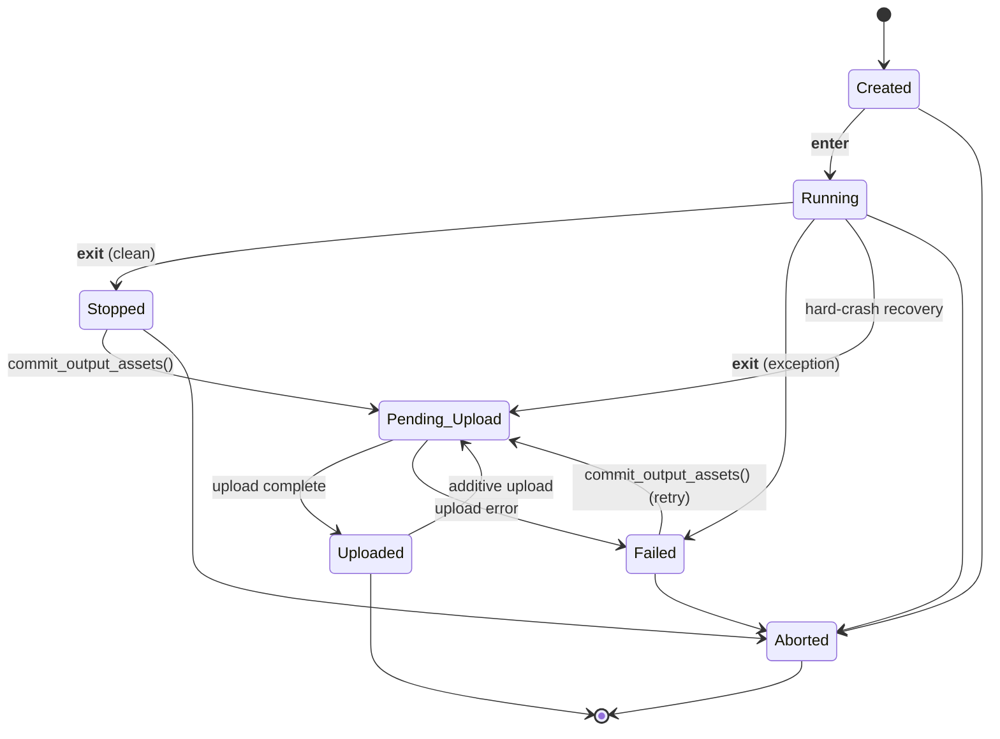

# Running an experiment

This chapter covers the full lifecycle of a DerivaML execution: configuring inputs, running a workflow inside the context manager, writing outputs, and uploading results to the catalog. By the end you will know how to run a reproducible experiment and understand every state the execution passes through along the way.

## The execution mental model

An **Execution** is DerivaML's unit of provenance. It links a specific run of your code (a **Workflow**) to exactly the inputs it consumed and the outputs it produced, with a start time, stop time, and status record. Everything produced inside an execution — feature records, model files, metrics — can be traced back to the exact code version and dataset version that generated it.

Executions are not self-contained scripts. They are catalog records that wrap your existing training or analysis code. The pattern is always: create an `ExecutionConfiguration`, open the context manager, do your work, then call `commit_output_assets()`. The catalog sees a clean audit trail; your code stays readable.

## How to describe an execution with ExecutionConfiguration

Before running anything you need to declare what the execution will consume. `ExecutionConfiguration` is a Pydantic model that collects that declaration.

**Motivation.** Declaring inputs up front lets DerivaML download and validate them before your model starts, record the exact dataset version used, and attach input provenance to the catalog record automatically.

```python
from deriva_ml.execution import ExecutionConfiguration
from deriva_ml.dataset.aux_classes import DatasetSpec

workflow = ml.create_workflow(
    name="ResNet50 Training",
    workflow_type="Training",
    description="Fine-tune ResNet50 on retinal images",
)

config = ExecutionConfiguration(
    workflow=workflow,
    description="Training run — learning rate 0.001",
    datasets=[
        DatasetSpec(rid="1-ABC"),                   # current version
        DatasetSpec(rid="1-DEF", version="2.1.0"),  # pinned version
    ],
    assets=["2-GHI"],  # bare RID strings are coerced to AssetSpec
)
```

**Explanation.** `workflow` holds the `Workflow` object returned by `ml.create_workflow()`. If you leave it `None` here you must pass `workflow=` to `ml.create_execution()` instead — the enforcement happens at `ml.create_execution()`, not at `ExecutionConfiguration` construction, so omitting it from both raises an exception only when you call `ml.create_execution()`. `description` is free-form Markdown. `datasets` accepts a list of `DatasetSpec` objects; `assets` accepts a list of RID strings or `AssetSpec` objects.

**DatasetSpec options:**

| Parameter | Type | Default | Description |
|-----------|------|---------|-------------|
| `rid` | str | required | Dataset RID |
| `version` | str | `None` | Specific version to use (default: current) |
| `materialize` | bool | `True` | Download asset files; `False` = metadata only |

Pass `materialize=False` when you only need the metadata tables and want to skip downloading large asset files.

**Notes:**

- `ExecutionConfiguration.assets` accepts plain RID strings but coerces them to `AssetSpec` objects via a Pydantic validator. When comparing assets in code, use `[a.rid for a in config.assets]`.
- For large immutable inputs (pretrained weights), use `AssetSpec(rid="...", cache=True)` to cache by MD5 and avoid redundant downloads across executions.
- The `config_choices` field captures Hydra group selections when running via `deriva-ml-run`, making exact reproduction possible from config names alone.

## How to run an execution

**Motivation.** The context manager handles timing and status transitions automatically. You focus on the science; DerivaML records when work started, when it stopped, and whether it succeeded.

```python
from deriva_ml.execution import ExecutionConfiguration
from deriva_ml.dataset.aux_classes import DatasetSpec

with ml.create_execution(config) as exe:
    print(f"Execution RID: {exe.execution_rid}")

    # Input datasets are declared in the config; download them here.
    bag = exe.download_dataset_bag(DatasetSpec(rid="1-ABC"))

    # Access members from the downloaded bag.
    images = bag.list_dataset_members()["Image"]

    # Run your model.
    model = train(images)

    # Register output files (do NOT write directly to working_dir).
    model_path = exe.asset_file_path("Model", "best_model.pt")
    torch.save(model.state_dict(), model_path)

# IMPORTANT: upload is OUTSIDE the context manager.
exe.commit_output_assets()
```

**Explanation.** `ml.create_execution(config)` inserts an Execution record in the catalog with status `Created`, then `__enter__` transitions it to `Running`. On a clean exit, `__exit__` transitions to `Stopped` and records the stop time. On an exception, `__exit__` transitions to `Failed` and stores the error message — then re-raises so your code sees the exception.

`commit_output_assets()` is a separate call after the context manager exits. It transitions the execution from `Stopped` to `Pending_Upload`, uploads all registered files to Hatrac, INSERTs staged feature records into ERMrest, then transitions to `Uploaded`.

**Notes:**

- `exe.execution_rid` — the RID of the catalog Execution record; use it to look up the run later.
- `exe.working_dir` — the local scratch directory for this execution; do not write output files here directly (they will not be uploaded). Use `asset_file_path()` instead.
- `exe.datasets` — the list of `DatasetSpec` objects from the configuration; iterate these to download each declared dataset.
- `exe.asset_paths` — a `dict[str, list[AssetFilePath]]` mapping asset table name → list of paths for downloaded input assets. Each asset lands at `<working_dir>/<exec_rid>/downloaded-assets/<asset_table>/<asset_rid>/<Filename>` (RID-keyed so two assets sharing a filename do not collide). Always read via `AssetFilePath.file_name`; do not hand-construct paths from the table or filename.

## How to write asset files

**Motivation.** All output files must be registered through `exe.asset_file_path()`. Files written directly to `exe.working_dir` are invisible to the upload machinery and will never reach the catalog.

```python
with ml.create_execution(config) as exe:

    # 1. Get a path for a new file — write to the returned path.
    model_path = exe.asset_file_path("Model", "classifier.pt")
    torch.save(model.state_dict(), model_path)

    # 2. Register an existing file (copied into staging).
    exe.asset_file_path("Image", "/tmp/processed.png", copy_file=True)
    # Note: the return value is dropped here intentionally. The file is already
    # on disk; you don't need to reference the AssetFilePath afterward unless
    # you plan to overwrite its metadata via the `.metadata = ...` setter or
    # call .set_asset_types([...]).

    # 3. Rename during staging.
    exe.asset_file_path("Image", "/tmp/temp_scan.png",
                        rename_file="scan_001.png")

    # 4. Tag with asset type vocabulary terms.
    exe.asset_file_path("Image", "mask.png",
                        asset_types=["Segmentation_Mask", "Derived"])

    # 5. Supply domain metadata columns and/or a description.
    path = exe.asset_file_path(
        "Image", "scan.jpg",
        description="Preprocessed fundus image",
        metadata={"Subject": subject_rid, "Acquisition_Date": "2026-01-15"},
    )
    # The `metadata` setter replaces the entire metadata dict in one go.
    # There is no per-key incremental update; merge into the existing dict
    # yourself before assigning.
    path.metadata = {**path.metadata, "Acquisition_Time": "14:30:00"}

exe.commit_output_assets()
```

**Explanation.** `asset_file_path(asset_name, file_name, ...)` has three modes depending on whether `file_name` names an existing file:

- **New file** (`file_name` does not exist): returns a `Path` to write to. Create the file after the call.
- **Symlink** (`file_name` exists, `copy_file=False`): symlinks the file into the staging directory.
- **Copy** (`file_name` exists, `copy_file=True`): copies the file into the staging directory.

Every registration is written to a crash-safe JSON manifest (`asset-manifest.json`) inside the execution workspace. This manifest survives process death; see [How to handle a crash-resume](#how-to-handle-a-crash-resume).

**Notes:**

- `asset_name` must be a valid asset table in the catalog. For execution metadata files (configs, logs, metrics), use `"Execution_Metadata"`.
- `asset_types` defaults to the asset table name if not provided.
- The returned `AssetFilePath` object exposes a `.metadata` property (read returns a dict, write accepts a dict or an `AssetRecord` and **replaces** the entire metadata dict — there is no incremental per-key update) and a `.set_asset_types([...])` method for post-registration updates.
- For feature-asset files (segmentation masks, embeddings), supply the path in the `FeatureRecord` field — the upload step substitutes the uploaded-asset RID automatically before inserting the feature record. See [Chapter 3](features.md) for details.

## How to write feature values

**Motivation.** Feature records must be created inside an execution context for provenance. `exe.add_features()` stages them in a local SQLite table; they are flushed to ERMrest only after assets have been uploaded. This ordering guarantees that asset-column features carry valid RIDs at insert time.

```python
feature = ml.lookup_feature("Image", "Glaucoma_Grade")
RecordClass = feature.feature_record_class()

records = [
    RecordClass(Image="1-IMG1", Glaucoma_Grade="Mild"),
    RecordClass(Image="1-IMG2", Glaucoma_Grade="Severe"),
]

with ml.create_execution(config) as exe:
    n = exe.add_features(records)
    print(f"Staged {n} records")
    # Records are NOT yet in ERMrest at this point.

# Records appear in ERMrest only after this call:
exe.commit_output_assets()
```

**Explanation.** `add_features(features)` writes the list to the `execution_state__feature_records` SQLite table with status `Pending`. All records in a single call must belong to one feature definition; mixing features raises `DerivaMLValidationError`. `commit_output_assets()` then assembles a bag containing both the uploaded asset bytes and the staged feature rows, substituting uploaded-asset RIDs into any asset-column fields before the bag is loaded into the catalog by `BagCatalogLoader`.

**Notes:**

- Staged rows survive process death. If the process crashes after `add_features()` but before `commit_output_assets()`, the rows are still in SQLite and will be flushed on the next `commit_output_assets()` call after resuming.
- Call `add_features()` as many times as needed; rows accumulate in SQLite and are flushed in one batch.
- `exe.add_features()` is the only way to write feature values. The top-level `ml.add_features()` method has been retired; any code using it should be updated.

## How to record training metrics

**Motivation.** Training runs produce per-epoch numbers — loss, accuracy, any eval metric — that you want to keep alongside the execution for later comparison and plotting. Metrics are not features (features describe rows of data, not the run that produced them), and they are not parameters (parameters describe inputs to the run). They are their own thing: scalars tagged by the training step that produced them. DerivaML records them as a plain text file attached to the execution as an `Execution_Metadata` asset — no extra catalog tables, no schema surgery.

```python
import json

with ml.create_execution(config) as exe:
    model = build_model()
    optimizer = build_optimizer(model)

    for epoch in range(num_epochs):
        train_loss = train_one_epoch(model, optimizer, train_loader)
        val_loss = evaluate(model, val_loader)

        with exe.metrics_file().open("a") as f:
            json.dump(
                {"epoch": epoch, "train_loss": train_loss, "val_loss": val_loss},
                f,
            )
            f.write("\n")

exe.commit_output_assets()
```

**Explanation.** `exe.metrics_file()` returns an `AssetFilePath` pointing at a file in the execution's staging directory, registers it with the asset manifest on first call, and stamps its asset type as `Metrics_File` so the catalog's `Execution_Metadata.Type` column honestly describes the purpose of the file. Repeat calls to `exe.metrics_file()` within the same execution return the same path, so appending across an epoch loop is safe. `commit_output_assets()` uploads the file to Hatrac and inserts a row into `Execution_Metadata` linked to the execution, just like any other asset.

The default filename is `metrics.jsonl` — one JSON record per line is the shape that lets downstream readers stream through the file without loading it whole. You can pass a different filename if you want to distinguish multiple streams (for example, `"train_metrics.jsonl"` and `"eval_metrics.jsonl"`); each distinct filename becomes its own `Execution_Metadata` asset on upload.

**Reading metrics back from a bag:**

```python
import json
from deriva_ml.core.enums import MLAsset

bag = dataset.download_dataset_bag(version="1.0.0")

# Find the metrics file in the bag's Execution_Metadata assets
metadata_dir = bag.path / "data" / "assets" / MLAsset.execution_metadata.value
metric_files = list(metadata_dir.rglob("metrics.jsonl"))

records = []
for path in metric_files:
    for line in path.read_text().splitlines():
        if line.strip():
            records.append({"execution_rid": path.parent.name, **json.loads(line)})

# records is now a list[dict] suitable for pd.DataFrame(records)
```

**Notes:**

- The file itself is plain text. JSON-lines is the recommended shape but CSV, YAML, or a single JSON object also work as long as your readback code knows the format. DerivaML never opens the file during upload — it only tracks it as a generic asset.
- `metrics_file()` is sugar, not substance. It is equivalent to `asset_file_path(MLAsset.execution_metadata, "metrics.jsonl", asset_types=ExecMetadataType.metrics_file.value)`. If you need the full call (e.g. to pass extra metadata), call `asset_file_path()` directly.
- For high-throughput logging (thousands of writes per second inside a tight batch loop), file-append is the wrong shape — the fsync cost dominates. Either buffer in memory and flush once per epoch, or open an issue if you have a concrete use case that needs server-side queryable metrics.
- Metrics written this way are **not** queryable from the catalog like features are — comparing metrics across runs requires downloading each bag and parsing the file. This is an intentional trade-off: the file-as-asset design keeps the API simple for lab-scale use (tens of runs per experiment), at the cost of not scaling to MLflow-style leaderboard queries.

## How execution-asset roles work

**Motivation.** Every asset linked to an execution carries an explicit
**direction** — was it consumed as input, or produced as output? Two
queries become trivial: "what did this execution read?" and "what did
this execution produce?" The directional tag also lets the catalog
show colour-coded provenance in Chaise and lets downstream lineage
tools walk only the relevant edges.

**The contract.** Every asset associated with an execution gets:

1. A row in `{Asset}_Execution` with `Asset_Role` set to either
   `"Input"` or `"Output"`.
2. A row in `{Asset}_Asset_Type` carrying the directional tag —
   `"Input_File"` for inputs, `"Output_File"` for outputs — in
   addition to whatever content tags (e.g., `"Model_File"`,
   `"Segmentation_Mask"`) the caller passed.

**deriva-ml assigns the role; you don't.** The framework decides
based on the call you made:

- `exe.download_asset(rid, dest_dir)` → role `"Input"`, tag
  `"Input_File"` added automatically.
- `exe.asset_file_path("Model", "model.pt")` followed by
  `exe.commit_output_assets()` → role `"Output"`, tag
  `"Output_File"` added automatically.

You never write `Asset_Role` yourself, and you don't need to pass
`Input_File`/`Output_File` in `asset_types=` — those are reserved
for the framework. User-supplied tags are content classifications
(what kind of file is it?); directional tags are framework-supplied
(which side of the execution did it sit on?).

**Querying by role.** Once an execution finishes,
`exe.list_assets(asset_role="Input")` and
`exe.list_assets(asset_role="Output")` give you exactly the assets
on each side. Catalog queries filtering by `Asset_Type == "Output_File"`
give you every asset ever produced by any execution.

```python
with ml.create_execution(config) as exe:
    # INPUT — role is "Input", auto-tagged "Input_File":
    img = exe.download_asset(image_rid, exe.working_dir / "inputs")
    assert "Input_File" in img.asset_types

    # ... run model on img ...

    # OUTPUT — role is "Output", auto-tagged "Output_File" after upload:
    mp = exe.asset_file_path("Model", "best.pt",
                             asset_types=["Model_File"])
    torch.save(model.state_dict(), mp)

exe.commit_output_assets()

# After upload, the Model row carries asset_types = ["Model_File", "Output_File"].
inputs = exe.list_assets(asset_role="Input")
outputs = exe.list_assets(asset_role="Output")
```

**Notes:**

- Passing `asset_types=["Output_File", ...]` explicitly is allowed (it's
  the canonical string) and is **deduplicated** — you won't get two
  `Output_File` rows. Likewise `asset_types=[]` (no content tags) is
  honored as-is and still gets the directional tag.
- The `Asset_Type` vocabulary terms `Input_File` and `Output_File` are
  seeded by `create_ml_schema()` / `initialize_ml_schema()`. An old
  catalog that predates this feature needs to be re-initialized once
  before uploads with content types will succeed.

## How to upload outputs

**Motivation.** Uploading is deliberately separate from running. Large file uploads can take minutes; keeping them outside the context manager means the execution timing reflects computation time, not upload latency. It also lets you inspect outputs before committing them to the catalog.

```python
with ml.create_execution(config) as exe:
    # ... your work ...
    model_path = exe.asset_file_path("Model", "best_model.pt")
    torch.save(model.state_dict(), model_path)

# Context exits here: status → Stopped. Upload is NOT triggered.

# Upload explicitly:
exe.commit_output_assets()
# Status: Stopped → Pending_Upload → Uploaded
```

**Upload ordering.** Asset files are uploaded first by `BagCatalogLoader`, then feature rows are inserted. This ordering is required because feature records that reference asset files need the uploaded-asset RIDs before the INSERT; the bag-build step pre-leases asset RIDs and rewrites feature rows to reference those RIDs so the loader can insert in a single FK-safe pass.

**Tuning for large files / slow connections.** Bag-commit (the post-cutover upload path) inherits the catalog session's HTTP timeout and Hatrac chunk size; tune those on the `DerivaML` instance rather than at the call site. There is no upload-level retry — the bag is uploaded in a single attempt and a failure raises ``DerivaMLUploadError``. Resumability comes from the manifest: a re-run of ``commit_output_assets()`` picks up only the entries marked ``pending``.

**Notes:**

- `__exit__` does NOT trigger upload. You must call `commit_output_assets()` explicitly.
- A `progress_callback` parameter accepts a callable `(UploadProgress) -> None` for custom progress reporting.
- The return value is an `UploadReport` — `execution_rids`, `total_uploaded`, `total_failed`, `per_table` per-(schema, table) counts, and per-execution `errors`. For per-asset path data (RIDs, filenames) read `exe.uploaded_assets` after the commit returns.

!!! warning "Upload is not automatic"
    Exiting the `with` block transitions the execution to `Stopped` but does **not** upload
    anything. If you omit `exe.commit_output_assets()`, the execution record stays in
    `Stopped` state indefinitely and no outputs appear in the catalog. Always call it
    explicitly after the context manager exits.

### One method, three callers

`commit_output_assets()` is the single entry point for committing an execution's outputs (ADR-0009). Whether you call it inline after a `with` block, after `resume_execution`, or via `deriva-ml-upload`, the end state is identical: the execution transitions to `Uploaded`, asset descriptions are written, `Upload_Duration` is recorded, and the working folder is optionally cleaned. Per-execution failure isolation is the job of the batch caller (`ml.commit_pending_executions` / the CLI), not the per-execution method.

```python
# 1. Inline — most common, right after the with block exits.
with ml.create_execution(cfg) as exe:
    ...
exe.commit_output_assets()

# 2. Resumed — e.g. recovery after a process restart.
exe = ml.resume_execution(rid)
exe.commit_output_assets()

# 3. Batch — drains every pending execution on the workspace.
report = ml.commit_pending_executions()           # all pending
report = ml.commit_pending_executions(            # explicit subset
    execution_rids=["EXE-A", "EXE-B"],
    clean_folder=True,                            # remove working dirs after
)

# 4. CLI — thin wrapper around (3) for out-of-process operator-driven uploads.
#    deriva-ml-upload --host h --catalog c --execution EXE-A --clean
```

See [ADR-0009](../adr/0009-unified-commit-output-assets.md) for the rationale and the two latent bugs the unification fixes.

## Execution status lifecycle

Each execution moves through a defined set of states. Transitions are enforced by the state machine; attempting an illegal transition raises `InvalidTransitionError`.



**State reference:**

| Status | When set | Description |
|--------|----------|-------------|
| `Created` | `ml.create_execution()` | Execution record inserted; no work has started. |
| `Running` | `__enter__` (or `execution_start()`) | Work in progress; start time recorded. |
| `Stopped` | `__exit__` (or `execution_stop()`) | Work finished cleanly; stop time recorded. |
| `Failed` | `__exit__` (exception) or upload error | Error message stored in catalog. |
| `Pending_Upload` | `commit_output_assets()` starts | Upload in progress. |
| `Uploaded` | `commit_output_assets()` completes | All outputs uploaded. Re-entrant — can cycle to `Pending_Upload` for an additive upload. |
| `Aborted` | explicit abort | Abandoned before completion; terminal. |

**Non-happy-path transitions:**

- **`Running → Pending_Upload`** — hard-crash recovery. The process was killed mid-run, so `__exit__` never fired and never moved status to `Stopped`. Resume the execution, call `update_status(ExecutionStatus.Pending_Upload)`, then `commit_output_assets()`. The audit trail stays honest: "Failed" means the run failed, not "the process died before it could mark itself finished."

- **`Failed → Pending_Upload`** — retry from upload failure. If `commit_output_assets()` raised after the execution already reached `Failed` (e.g., a transient network error), staging is intact; call `commit_output_assets()` again to retry.

- **`Uploaded → Pending_Upload`** — additive upload. The execution finished and its initial asset batch successfully uploaded, but a second lifecycle owner needs to ship more assets against the same execution. The classic case is a runner harness wrapping a kernel: the kernel uploads its own outputs (status reaches `Uploaded`), the runner then registers assets only it can produce safely (e.g., the Hydra job log it owns) and calls `commit_output_assets()` again. `commit_output_assets()` automatically takes this transition when there are pending manifest entries; if there are none, the call is a no-op and status stays `Uploaded`. Asset rows linked to an execution have no temporal constraint vs. its status — an execution's upload is a batch operation, not a wall.

**Disallowed transitions worth knowing:**

- `Stopped → Failed` — an execution that stops cleanly can only move to `Pending_Upload` next. Failure has to happen inside an upload, not after work completed.
- `Created → Stopped` — `Stopped` requires `Running` first; you cannot skip the active state.
- `Uploaded → Failed` — once an upload succeeds, the only way back to upload activity is via `Pending_Upload` (the additive-upload path above), not directly into `Failed`.

## How to update status during a run

Report progress inside a long-running loop so anyone monitoring the catalog can see where the execution is.

```python
from deriva_ml.execution.state_store import ExecutionStatus

with ml.create_execution(config) as exe:
    exe.update_status(ExecutionStatus.Running, "Loading dataset...")
    data = load_data()

    for epoch in range(num_epochs):
        loss = train_epoch(model, data)
        exe.update_status(
            ExecutionStatus.Running,
            f"Epoch {epoch + 1}/{num_epochs} — loss={loss:.4f}"
        )

    exe.update_status(ExecutionStatus.Running, "Saving checkpoint...")
    model_path = exe.asset_file_path("Model", "model_final.pt")
    torch.save(model.state_dict(), model_path)

exe.commit_output_assets()
```

`update_status(status, message)` writes `status` to `Execution.Status` and `message` to `Execution.Status_Detail` in the catalog, making progress visible immediately. When you want to update the progress message without changing state, pass the current status (typically `Running`) as the first argument; only the message changes.

## How to handle a crash-resume

**Motivation.** If the process dies mid-run — power failure, OOM, SIGKILL — staged feature records and registered asset files are preserved in the SQLite execution state store and the `asset-manifest.json` manifest. You can resume from where the upload left off without re-running the model.

```python
# Original run — process crashes after add_features() but before upload.
with ml.create_execution(config) as exe:
    rid = exe.execution_rid
    records = build_feature_records()
    exe.add_features(records)  # staged to SQLite; process dies here
    # ... upload never called ...

# Later — resume the execution by RID.
exe = ml.resume_execution(rid)

# Upload flushes the still-pending rows from SQLite.
exe.commit_output_assets()
```

**Explanation.** `ml.resume_execution(rid)` rebuilds an `Execution` object bound to the existing catalog record and its local SQLite state. When `commit_output_assets()` runs, it discovers the pending feature rows and asset manifest entries and processes them as if the run had just completed.

**Two distinct crash scenarios:**

**Scenario A — exception inside the `with` block.** If your code raises and `__exit__` runs, the execution transitions to `Failed`. On restart, `ml.resume_execution(rid)` returns an execution already in `Failed` state. `commit_output_assets()` accepts `Failed` as a starting point (`Failed → Pending_Upload` is a legal transition) and flushes any staged outputs.

**Scenario B — hard process crash (SIGKILL, OOM, power failure) inside the `with` block.** `__exit__` never runs, so the execution stays in `Running` in both SQLite and the catalog. On restart, `ml.resume_execution(rid)` runs just-in-time reconciliation: since both sides agree on `Running`, reconciliation is a no-op and the execution is returned still in `Running` state. Advance it to `Pending_Upload` and then call the upload helper:

```python
exe = ml.resume_execution(rid)
# Execution is in Running state — advance directly to Pending_Upload
# to signal "the owning process died; please upload what I staged."
exe.update_status(ExecutionStatus.Pending_Upload)
exe.commit_output_assets()   # Pending_Upload → Uploaded
```

`Running → Pending_Upload` is an intentional recovery edge in the state graph: it documents "this run never got to mark itself finished" without lying about the run's outcome (the audit trail stays free of a spurious `Failed` marker). `commit_output_assets()` then flushes any staged feature rows and asset manifest entries that survived in SQLite, completing the upload without re-running the model.

**Notes:**

- Staged feature records survive process death because SQLite writes are fsync'd on every mutation.
- Asset files in the manifest with status `pending` are re-uploaded; already-uploaded entries are skipped.
- `resume_execution()` is also useful when you want to add more outputs to a completed execution without re-running it, for example to attach post-hoc analysis files.

## CLI reference

`deriva-ml-run` and `deriva-ml-run-notebook` run model functions and Jupyter notebooks with Hydra-zen configuration and automatic execution tracking. Both tools create an `ExecutionConfiguration` from the config store, call `ml.create_execution()`, and call `commit_output_assets()` after the model function returns. You do not call these steps manually when using the CLI.

### deriva-ml-run

```
deriva-ml-run [--host HOST] [--catalog CATALOG] [--config-dir DIR]
              [--config-name NAME] [--info] [--multirun|-m] [OVERRIDES...]
```

| Argument | Default | Description |
|----------|---------|-------------|
| `--host HOST` | from config | Deriva server hostname |
| `--catalog CATALOG` | from config | Catalog ID |
| `--config-dir DIR`, `-c` | `src/configs` | Path to the configs directory |
| `--config-name NAME` | `deriva_model` | Name of the main Hydra-zen config |
| `--info` | | Show available config groups and options |
| `--multirun`, `-m` | | Enable Hydra multirun for parameter sweeps |
| `OVERRIDES` | | Hydra-zen configuration overrides (positional) |

```bash
# Run with defaults
uv run deriva-ml-run

# Override config group and parameter
uv run deriva-ml-run model_config=quick model_config.epochs=5

# Use an experiment preset
uv run deriva-ml-run +experiment=cifar10_quick

# Dry run (downloads inputs, skips catalog writes)
uv run deriva-ml-run dry_run=true

# Named parameter sweep
uv run deriva-ml-run +multirun=lr_sweep
```

### deriva-ml-run-notebook

```
deriva-ml-run-notebook NOTEBOOK [--host HOST] [--catalog CATALOG]
                       [--file FILE] [--parameter KEY VALUE]
                       [--kernel KERNEL] [--inspect] [--info]
                       [--log-output] [OVERRIDES...]
```

| Argument | Default | Description |
|----------|---------|-------------|
| `NOTEBOOK` | required | Path to the `.ipynb` file |
| `--host HOST` | from config | Deriva server hostname |
| `--catalog CATALOG` | from config | Catalog ID |
| `--file FILE`, `-f` | | JSON or YAML file with parameter values |
| `--parameter KEY VALUE`, `-p` | | Inject a parameter (repeatable) |
| `--kernel KERNEL`, `-k` | auto-detected | Jupyter kernel name |
| `--inspect` | | Show notebook parameters and exit |
| `--log-output` | | Stream cell output during execution |
| `OVERRIDES` | | Hydra-zen overrides (positional) |

```bash
# Run a notebook with defaults
uv run deriva-ml-run-notebook notebooks/train.ipynb

# Inject parameters into the notebook's parameters cell
uv run deriva-ml-run-notebook notebooks/train.ipynb \
    -p learning_rate 0.001 -p epochs 50

# Override Hydra config groups
uv run deriva-ml-run-notebook notebooks/analysis.ipynb \
    assets=my_assets deriva_ml=production

# Inspect available parameters without running
uv run deriva-ml-run-notebook notebooks/train.ipynb --inspect
```

The CLI tools handle Jupyter kernel detection, `nbstripout`-based checksum computation, and environment variable injection automatically. See [Integrating with hydra-zen](hydra-zen.md) for the full guide to setting up `configs/` and writing model functions.

---

!!! warning "Common pitfalls"

    **`__exit__` does not upload.** Exiting the `with` block records the stop time and
    transitions to `Stopped`. It does not upload anything. Always call
    `exe.commit_output_assets()` explicitly after the context manager exits. Omitting
    it leaves the execution in `Stopped` and no outputs appear in the catalog.

    **Writing files directly to `working_dir`.** Only files registered through
    `exe.asset_file_path()` are uploaded. Writing a file to
    `exe.working_dir / "Execution_Metadata" / "my-metrics.json"` directly bypasses the
    manifest and the file is silently ignored during upload.

    **Workflow deduplication.** `ml.add_workflow()` deduplicates by checksum. Running the
    same committed script twice reuses the same `Workflow` row — that is correct behavior.
    If you need distinct workflow records (for example, in tests), use different scripts or
    override `url` and `checksum` explicitly.

    **Dirty working tree.** Running with uncommitted changes causes a warning. The Workflow
    record records the last committed URL, which may not match the code that actually ran.
    Commit before running. `DERIVA_ML_ALLOW_DIRTY=true` suppresses the warning but is
    intended for tests only — using it in production pollutes your provenance record.

## How to trace an artifact's lineage

DerivaML records the full provenance graph for every artifact: which Execution produced
it, what inputs that Execution consumed, what Executions produced those inputs, and so
on back to the original raw data. To answer "how did this come to exist?" for any
Dataset, Asset, Feature value, or Execution RID, use `lookup_lineage()`:

```python
from deriva_ml import DerivaML

ml = DerivaML(hostname="data.example.org", catalog_id="1")

# Single call walks the full chain back to the root.
lineage = ml.lookup_lineage("2-PRED1")    # the predictions.csv asset RID

print(lineage.root.type, lineage.root.description)
# Asset Trained-model predictions on test set v0.4.0

print(f"Walked {lineage.executions_visited} executions; complete={lineage.walked_complete}")
```

The returned `LineageResult` is a Pydantic tree where each `LineageNode` carries a
summary of its producing Execution (RID, description, workflow name, status), the
input Datasets and Assets that Execution consumed, and the recursive `parents` list of
producing Executions for each input.

**Common patterns.**

| Question | Call |
|---|---|
| What produced this asset/dataset/feature? | `ml.lookup_lineage(rid)` — read `lineage.root.producing_execution` |
| What's the full chain back to the raw data? | `ml.lookup_lineage(rid)` — walk `lineage.lineage.parents` recursively |
| Just the immediate producer, no parent chain | `ml.lookup_lineage(rid, depth=0)` |
| Two generations back, no further | `ml.lookup_lineage(rid, depth=2)` |

**Bounds and safety.** The walk is unbounded by default — provenance traversal is an
infrequent, deliberate request, not a hot path. Cycle detection is mandatory: if the
catalog is corrupted with a true execution-chain cycle, the response sets
`cycle_detected=True` and the walk aborts on that branch. A `max_executions=500` hard
cap prevents pathological runaway walks; if hit, `walked_complete=False`.

**Diamond DAGs.** When the same parent Execution is reachable via two different
inputs, it appears once in the tree and subsequent encounters are marked
`already_shown=True` to keep the response compact and the structure honest.

**Data-flow only.** `lookup_lineage` walks data-flow parents (the Executions that
produced this Execution's consumed inputs). It does **not** walk
`Execution_Execution` (orchestration parent-child links — the "this Execution called
that Execution" relationship). For the orchestration view, use
`list_nested_executions` instead. The two views answer different questions and are
kept separate by design (see ADR-0001 in `docs/adr/`).

**No producer.** If the artifact has no producing-execution link (manually-inserted
data, or data loaded outside an execution), the call still succeeds:
`lineage.root.producing_execution` is `None` and `lineage.lineage` is `None`. "It has
no recorded producer" is a valid answer to "how did this come to exist?".

For the full method signature and the Pydantic model definitions, see
[API Reference — Lineage](../api-reference/lineage.md).

## See also

- [Chapter 3 — Defining and using features](features.md): creating feature definitions, `FeatureRecord` classes, and asset-based features.
- [Chapter 5 — Working offline](offline.md): `DatasetBag` API, `restructure_assets()`, working without a catalog connection.
- [Reproducibility](reproducibility.md): `bump-version`, Git commit discipline, what DerivaML records per execution.
- [Integrating with hydra-zen](hydra-zen.md): full project layout, `create_model_config()`, experiment presets, multirun sweeps.
